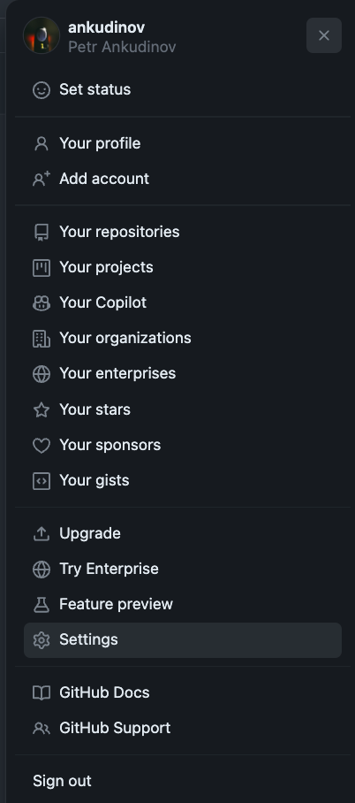
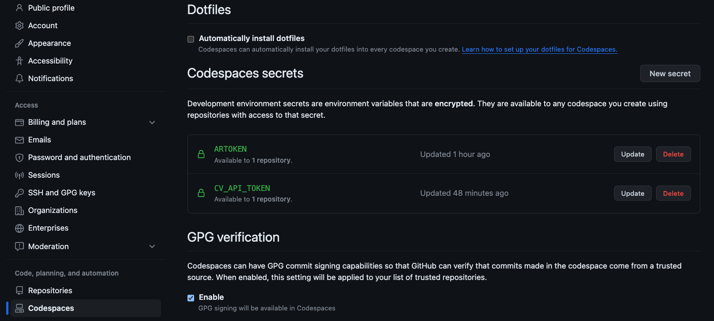

# One Click SE Demos

A pool of SE demos that can be started in Github Codespaces with one-click.  

> WARNING:
>
> - this repo is still under construction.
> - if you have not requested bigger Codespaces options from Github support - 4 cores is the maximum available option by default.
>   Please only start demos marked as `Works with 4-cores` in that case.

Before you start:

> WARNING: Do NOT set your tokens under repository settings. In that case they will be visible for all contributors. You may not want contributors to download EOS images with your token. Also keep the token lifetime short enough and refresh it periodically.

- Go to the account settings (right top corner)

  

- Go to `Codespaces > Codespaces secrets > New secret`
- add ARTOKEN to auto-download EOS images from [arista.com](arista.com). Under `Repository access` select `arista-netdevops-community/one-click-se-demos`
- add CV_API_TOKEN if CVaaS is part of the demo. Keep in mind, this token has to be created under service account. Device onboarding token is not required as it will be generated automatically. Under `Repository access` select `arista-netdevops-community/one-click-se-demos`

  

> WARNING:  
> Do NOT forget to set `Repository access` for your secrets, otherwise they will be inactive.

Start demo:

- EVPN AA  
  `Works with 4-cores`  

  

- EVPN MLAG  
  `Works with 4-cores`  

  

To run the demo:

- wait until cEOS-lab image will be imported. Check with `docker image ls`
- `make start` - start cLab
- wait until all devices will start streaming to CVaaS. This may take a while.
- `make build` - build configs with AVD
- `make deploy_cvp` - create CVP change control
- execute the change control on CVP after review
- `make tags` - assign tags for CVP topology view. Currently there is a bug with disabling LLDP on Ma0, which prevents topology view from functioning correctly.
- `make test` - validate the deployment with ANTA

> WARNING:
>
> - Codespaces have 30 minutes inactivity timeout.
> - Please do NOT forget to delete the Codespaces you started when you don't need them any more. You can find the full list of Codespaces here: [github.com/codespaces](https://github.com/codespaces)

Credits:

- cEOS-lab image is the core of every demo
- Github infrastructure for public repos. Github Actions, Packages, Pages and Codespaces - they are all amazing. One-click demo would not be possible without them.
- Containerlab - it significantly reduces complexity of deploying labs in DevOps way.
- Arista EOS downloader (or sometimes it's shell alternative) - allows to uncage amazing cEOS-lab images hidden behind [arista.com](arista.com) login.
