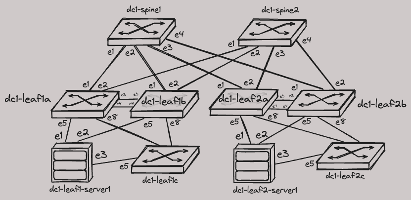

# AVD Extended Workshop, Part 1

!!! Warning "Lab Documents Not Finished"

    DO NOT ENTER!

    

    This document is created from a Cookiecutter template.
    If you see this message - the lab is not finished and likely published for testing purposes.
    Don't use it unless you are the author.

## Demo Details

!!! Success "Container Requirements"

    CPUs: 4  
    Memory: 16 GB  
    Storage: 32 GB  

    :material-checkbox-marked-outline: Works with default Codespaces sizing!

[Start "AVD Extended Workshop, Part 1" in Codespace](https://codespaces.new/arista-netdevops-community/one-click-se-demos?quickstart=1&devcontainer_path=.devcontainer%2Favd-avd-extended-workshop--part-1%2Fdevcontainer.json){ .md-button .md-button--primary target=_blank}

[Slides](https://arista-netdevops-community.github.io/one-click-se-demos/slides/avd-avd-extended-workshop--part-1.html){ target=_blank }  
[PDF Slides](https://arista-netdevops-community.github.io/one-click-se-demos/pdfs/avd-avd-extended-workshop--part-1.pdf){ target=_blank }  

!!! Info "Last reviewed: 29/04/2024"

    Demos and labs reviewed over 6 month age may be outdated.

## Lab Topology



## How To Run The Demo

???+ Tip "Wait until cEOS-lab image will be imported"

    You can confirm if image was imported correctly with `docker image ls`.  
    In some rare cases the cEOS-lab image may fail to be downloaded.
    For example due to incorrecte token or other API failure on arista.com.  
    In that case you can upload the image manually by right-clicking the Explorer tab of the VSCode interface.

```bash
# 1. start cLab
make start
```

???+ Tip "Wait until all devices will start streaming to CVaaS."

    This may take a while.
