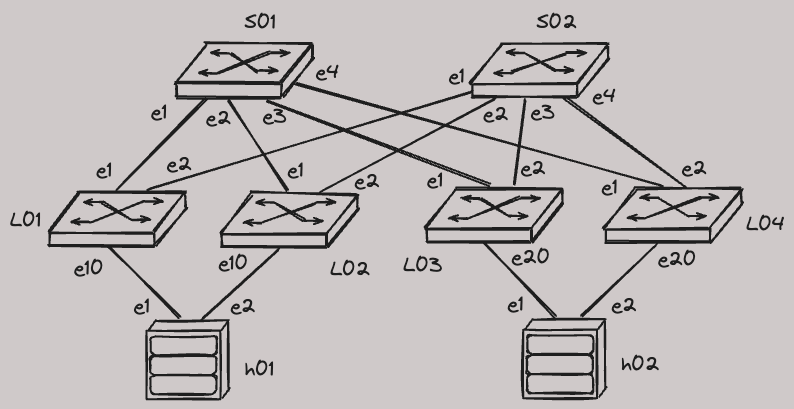

# CVaaS and AVD Demo, EVPN AA

## Demo Details

!!! Warning "Container Requirements"

    CPUs: 8  
    Memory: 32 GB  
    Storage: 64 GB  

    :material-alert-circle-outline:{ .heartbeat } Please request high spec Codespace machines from [Github support](https://support.github.com/) first!

[Start "CVaaS and AVD Demo, EVPN AA" in Codespace](https://codespaces.new/{{gh.repository}}/tree/{{gh.branch}}?quickstart=1&devcontainer_path=.devcontainer%2Fcvaas-cvaas-and-avd-demo--evpn-aa%2Fdevcontainer.json){ .md-button .md-button--primary target=_blank}

[Slides](https://{{gh.org_name}}.github.io/{{gh.repo_name}}/slides/cvaas-cvaas-and-avd-demo--evpn-aa.html){ target=_blank }  
[PDF Slides](https://{{gh.org_name}}.github.io/{{gh.repo_name}}/pdfs/cvaas-cvaas-and-avd-demo--evpn-aa.pdf){ target=_blank }  

!!! Info "Last reviewed: 02/08/2024"

    Demos and labs reviewed over 6 month age may be outdated.

## Lab Topology



## How To Run The Lab on Your Machine

It is possible to run the lab on your local machine (or any server) instead of using Github Codespaces.  
You can [download all required lab files here](https://arista-netdevops-community.github.io/one-click-se-demos/lab_archives/cvaas-cvaas-and-avd-demo--evpn-aa.tar.gz).  
However you must take care of you VSCode setup and setting up environment variables. Also keep in mind that auto-downloaded image will not work on ARM-based MacBooks.

## How To Run The Demo

???+ Tip "Wait until cEOS-lab image will be imported"

    You can confirm if image was imported correctly with `docker image ls`.  
    In some rare cases the cEOS-lab image may fail to be downloaded.
    For example due to incorrecte token or other API failure on arista.com.  
    In that case you can upload the image manually by right-clicking the Explorer tab of the VSCode interface.

```bash
# 1. start cLab
make start
```

???+ Tip "Wait until all devices will start streaming to CVaaS."

    This may take a while.

```bash
# 2. build configs with AVD
make build
# 3. create CVP change control (1)
make deploy_cvp
# 4. assign tags for CVP topology view (2)
make tags
# 5. validate the deployment with ANTA preview
make test
```

1. !!! Tip "Review and execute the change control on CVP when all tasks will be created."
2. !!! Bug "Currently there is a bug with disabling LLDP on Ma0, which prevents topology view from functioning correctly."

Connect to a host (h01 or h02) and execute `test` alias to confirm connectivity.  
Execute following commands to verify EVPN control plane:

```text
show ip bgp summary
show bgp evpn summary
show bgp evpn route-type ip-prefix ipv4
show bgp evpn route-type mac-ip
```

Do any other testing in the lab.  
Impress your customer, colleagues or make yourself a bit smarter and happier.  
You rock! 🚀
