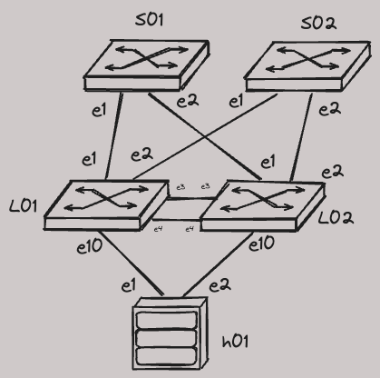

# Small EVPN MLAG

!!! Warning "How to use playground labs"

    Playground section contains a set of topologies that you can start and configure as on your own.  
    To make your data persistent - keep it in an external repository that you can clone to the lab workspace when it starts.

## Demo Details

!!! Success "Container Requirements"

    CPUs: 4  
    Memory: 16 GB  
    Storage: 32 GB  

    :material-checkbox-marked-outline: Works with default Codespaces sizing!

[Start "Small EVPN MLAG" in Codespace](https://codespaces.new/{{gh.repository}}/tree/{{gh.branch}}?quickstart=1&devcontainer_path=.devcontainer%2Fplayground-small-evpn-mlag%2Fdevcontainer.json){ .md-button .md-button--primary target=_blank}

!!! Info "Last reviewed: 02/08/2024"

    Demos and labs reviewed over 6 month age may be outdated.

## Lab Topology



## How To Run The Lab on Your Machine

It is possible to run the lab on your local machine (or any server) instead of using Github Codespaces.  
You can [download all required lab files here](https://{{gh.org_name}}.github.io/one-click-se-demos/lab_archives/playground-small-evpn-mlag.tar.gz).  
However you must take care of you VSCode setup and setting up environment variables. Also keep in mind that auto-downloaded image will not work on ARM-based MacBooks.

## How To Run The Demo

???+ Tip "Wait until cEOS-lab image will be imported"

    You can confirm if image was imported correctly with `docker image ls`.  
    In some rare cases the cEOS-lab image may fail to be downloaded.
    For example due to incorrecte token or other API failure on arista.com.  
    In that case you can upload the image manually by right-clicking the Explorer tab of the VSCode interface.

```bash
# 1. start cLab
make start
```

???+ Tip "Wait until all devices will start streaming to CVaaS."

    This may take a while.
