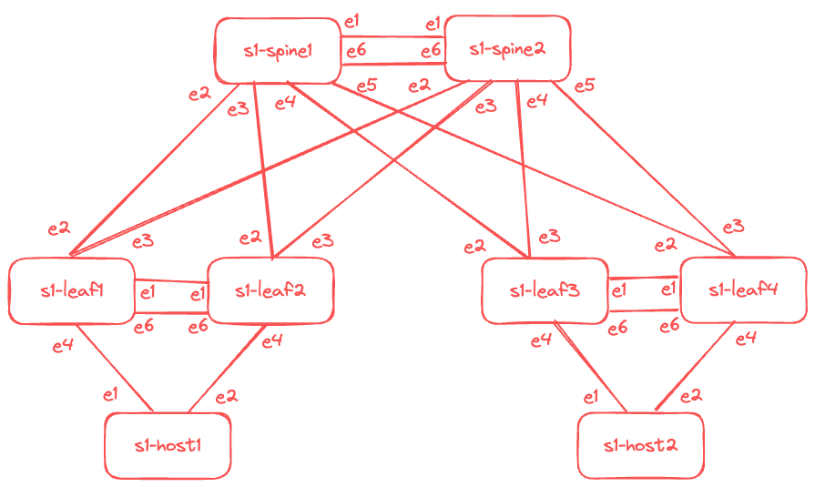

# AVD Extended Workshop, Part 1

<!-- Do not add page number on this slide -->
<!--
_paginate: false
-->

```text
Intro into Ansible, Ansible AVD, Git
and VSCode for new and existing AVD users

Petr Ankudinov
                                    31/03/2024
```


---

# What is this Workshop about?

<style scoped>section {font-size: 18px;}</style>


- This workshop is 3 sections:
  - Part 1, Intro:
    - Introducing the tools
    - Get the lab environment up and running
    - How to setup Ansible AVD environment
    - Run AVD playbooks
    - Make some changes in AVD repository
  - Part 2, Ansible and Git 101
  - Part 3, Common provisioning cases
- Each section requires around 2 hours to complete. The entire workshop can be complete in a single day or split into 3 seperate sessions.
- Make a break when you see a slide with a coffee cup ☕️
- Ask questions at any time!

---

# Test Dark

check topology on dark



---

# Test Light

<style scoped>
section {background: linear-gradient(to bottom, #FFFFFF, #FFFFFF); color: black; }
h1 {color: black;}
</style>

check topology on light


---

<style scoped>section {font-size: 45px;}</style>


# Q&A

- [Ansible AVD](https://avd.arista.com/)
- [This repository](https://github.com/{{gh.repository}})
