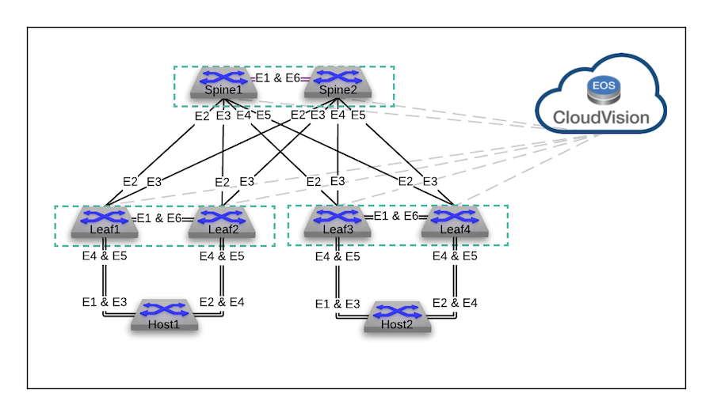
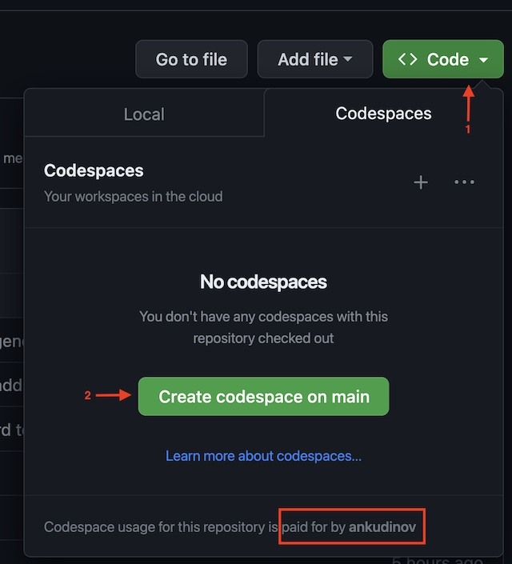

# AVD Extended Workshop

<!-- Do not add page number on this slide -->
<!--
_paginate: false
-->

<style scoped>
code {
  font-family: "Bradley Hand", cursive;
}
</style>

```Intro into Ansible, Ansible AVD, Git and VSCode for new and existing AVD users```


---

# What is this Workshop about?

<!-- Add footer starting from this slide -->
<!--
footer: 'Arista Ansible AVD Extended Workshop, 2023'
-->

<style scoped>section {font-size: 14px;}</style>


- This workshop is split into 3 sections. Each section takes around 2 hours to complete. That can be done as a full day workshop or split into 3 separate sessions.
- Topics:

  > - Section 1 - Intro:
  >   - Introducing the Tools
  >   - Before We Start - get lab environment up and running
  >   - How to setup Ansible AVD in Arista Test Drive environment
  >   - Prepare Github Codespaces Environment
  >   - Run AVD Playbooks
  >   - Make Some Changes in AVD Repository
  > - Section 2 - Ansible and Git 101
  > - Section 3 - Common AVD provisioning cases

- Make a break when you see a slide with a coffee cup ☕️
- Ask questions at any time!

---

# What is NOT covered in this Workshop?

<style scoped>section {font-size: 22px;}</style>

- This workshop is not a deep dive into each and every topic. It is covering some advanced concepts, but you may need additional documentation and training to understand every topic in details.  
  For additional information please refer to the following resources:
  - [Ansible AVD Documentation](https://avd.arista.com/)
  - [VSCode Documentation](https://code.visualstudio.com/docs)
  - [Git Documentation](https://git-scm.com/doc) - Pro Git book is a good start
  - Container Trainings by [@jpetazzo](https://github.com/jpetazzo):
    - [Github repository](https://github.com/jpetazzo/container.training)
    - [Training materials](https://container.training/)
- We are not going to use Arista CloudVision Portal (CVP) in this workshop. It provides a lot of advantages, but is not essential to understand the concepts covered in this workshop.
- If you will not find something you expect in this workshop, there can be 2 reasons:
  - It is not covered in this workshop
  - It is waiting for your contribution to this repository! 🤝

---

# Requirements

<style scoped>section {font-size: 24px;}</style>

- You **MUST** have a Github account❗
  Register [here](https://github.com/join).
- You **MUST** have an [arista.com account](https://www.arista.com/en/login) to download cEOS-lab image for Codespaces.


---

# References

<style scoped>section {font-size: 22px;}</style>

- If you are not using ATD, the functionality of this repository will rely on many amazing open source projects:
  - [ContainerLab](https://containerlab.srlinux.dev/)
  - [VSCode](https://code.visualstudio.com/)
  - [DevContainers](https://code.visualstudio.com/docs/remote/containers)
  - [Marp](https://marp.app/)
  - [Excalidraw VSCode](https://github.com/excalidraw/excalidraw-vscode)
- This repository is also relying on following free/commercial Github features:
  - [Github Actions](https://github.com/features/actions)
  - [Github Pages](https://pages.github.com/)
  - [Github Codespaces](https://github.com/features/codespaces)
- All photos are taken from [Pexels](https://www.pexels.com/) and [Unsplash](https://unsplash.com/). Excellent free stock photos resources. It's not possible to reference every author individually, but their work is highly appreciated.

---

# Additional Arista Workshops

- Check following workshops for additional information:
  - [ATD-AVD Workshop](https://github.com/arista-netdevops-community/atd-avd)
  - [Arista CI Workshops](https://aristanetworks.github.io/avd-workshops/)

---

# Introducing The Tools

<style scoped>
section {background: linear-gradient(to bottom, #000000, #434343);}
ul {font-size: 12px;}
</style>


`Section 1.1`

> - The bird view on the tools we are going to use in this workshop.
> - No details, they will come in a later sections. Just and overview.

---

# What is Git?


- **In Short**:
  > Git is a distributed version control system that tracks changes to a set of files and enables collaborative work.
- **Fun Fact**:
  > [Git was created](https://git-scm.com/book/en/v2/Getting-Started-A-Short-History-of-Git) by Linus Torvalds in 2005 to develop Linux kernel.

---

# What is GitHub?


- GitHub is a Git repository hosting platform.
- Allows to coordinate multiple local copies of the same repository and more.

---

# VSCode

<style scoped>section {font-size: 24px;}</style>


- Visual Studio Code is an extensible source-code editor developed by Microsoft and free to use.
- This will be our main tool to work with Ansible AVD and interact with Git repositories in the workshop and production.
- We are not going to cover VSCode installation and customization in this workshop. Check [VSCode documentation](https://code.visualstudio.com/docs) for details.

---

# Before We Start

<style scoped>
section {background: linear-gradient(to bottom, #000000, #434343);}
ul {font-size: 12px;}
</style>


`Section 1.2`

> - How to get your lab environment up and running

---

# How to use this Workshop?

<style scoped>section {font-size: 24px;}</style>

- To try all practical examples you need to have access to the lab environment. There are 3 possible options:
  - Use Github Codespaces. This is the preferred option, but double check that you understand all the costs and free tier limits.
  - Use Arista Test Drive - Single DC topology. Please ask your Arista SE to create an ATD lab for you.
  - Build your own lab environment: Ubuntu LTS + Docker + ContainerLab. This option is not described in detail, but the devcontainer used to build Codespaces environment will work on any machine with Docker installed. Please contact your SE if you need help.

---

# Lab Topology

<style scoped>section {font-size: 22px;}</style>

- This workshop is using Arista Test Drive Single DC topology.
- To match minimize resources and fit default Codespaces 4-core machine, the topology was reduced by removing leaf3, leaf4, host1 and host2.
- Feel free to adjust Ansible inventory and group variables if you are using ATD lab and would prefer to activate them all. But it's not essential for this workshop.
- CVP is not used as it's not required for this workshop.



---

# Github Repository Import

<style scoped>section {font-size: 24px;}</style>


- Create a copy of this repository on your Github account. That will allow you to make any changes without impacting the original repository.
- Alternatively you can fork this repository, but in this case you must **NOT** (❕) open any pull requests to the original repository.
- To make a copy of the repository click ➕ button in the top right corner of the Github page and select `Import repository` option.

---

# Github Repository Import, Step 2

<style scoped>section {font-size: 20px;}</style>


- Enter the following URL in `Your Old Repository's Clone URL` field:
  - `https://github.com/arista-netdevops-community/avd-extended-workshop`
- Use your own account in `Owner` field and `avd-extended-workshop` or another name in the `Repository Name` field.
- Create `Public` repository. That will simplify interaction with this repo and allow use of Github free features.
- Wait until the import is completed.
- Your clone will now be referenced as `<your-copy-of-this-repository>` in this workshop.

---

# Github Repository Import, Step 3

<style scoped>section {font-size: 20px;}</style>


- Confirm that `main` is the default Git branch after the import.
- Click `Settings` tab in the top right corner of the Github page.
- Click `General` on the left panel.
- Scroll down to `Default branch` section, click `Switch to another branch` button and select `main` branch.
- All set! 🎉

---

# How to Setup ATD Environment

<style scoped>
section {background: linear-gradient(to bottom, #000000, #434343);}
ul {font-size: 12px;}
</style>


`Section 1.3`

> - skip hands on in this section if you are using Codespaces
> - still read the slides as they explain AVD installation process

---

# How to setup Ansible AVD in Arista Test Drive environment?

- We could use a script to setup required Ansible collections and tools in Arista Test Drive environment, but it's a good opportunity to discuss what are the requirements but installing them manually.
- For details please check [AVD documentation](https://avd.arista.com/) `Installation > Collection Installation` section.

---

# Open Programmability IDE

<style scoped>section {font-size: 20px;}</style>


- Use the lab token provided by Arista representative to access the lab environment.
- Check the status of the lab environment. If it's `Shutdown` - click `Start` button.
- Click `Programmability IDE` button to open VSCode in the browser:
  - To access `Programmability IDE` use the password listed on the starting Web page.
  - The VSCode functionality in the Web browser is provided by [ATD Code server container](https://github.com/aristanetworks/atd-public/blob/nested-release/nested-labvm/atd-docker/coder/Dockerfile)
- Click `Yes, I trust the authors` button to continue. 🕵️
- Open new terminal in VSCode: `Top Left Corner (3 parallel lines) > Terminal > New Terminal`

---

# Install Ansible AVD

<style scoped>section {font-size: 20px;}</style>

```bash

# 1. Update package index files
sudo apt-get update

# 2. Install iputils as life is hard without ping
sudo apt-get install -y --no-install-recommends iputils-ping

# 3. Add .local/bin in home folder to PATH
export PATH=$PATH:/home/coder/.local/bin

# 4. Upgrade pip and install Ansible core
#    If you get errors, ignore. This bug will be fixed soon.
pip install --upgrade pip
pip3 install "ansible-core>=2.13.1,<2.14.0"

# 5. Install Arista AVD collection
ansible-galaxy collection install arista.avd:==4.1.0

# 6. Install AVD collection requirements
pip3 install -r /home/coder/.ansible/collections/ansible_collections/arista/avd/requirements.txt
```

For additional details check Arista Ansible AVD [Collection installation docs](https://avd.arista.com/4.1/docs/installation/collection-installation.html).

---

# Ansible Installation Warnings

<style scoped>section {font-size: 20px;}</style>


- Double check that the path to Ansible collection is correct. Normally it is expected to be in `/home/coder/.ansible/`
- You `PATH` environment variable must be set correctly!
- Never install Ansible as root user!
- Watch out for environments with a long history, conflicting Python installations etc.
- Containers make it simple! Use containers! 🐳
  > The Codespaces environment is based on a container with all requirements installed.

---

# Setup Ansible AVD Repository

<style scoped>section {font-size: 20px;}</style>

```bash
# 1. install yq to adjust AVD yaml files - https://github.com/mikefarah/yq
#    you can certainly edit yaml files manually, but there would be no fun 👎
export VERSION="v4.34.1" BINARY="yq_linux_amd64"
sudo wget https://github.com/mikefarah/yq/releases/download/$VERSION/$BINARY -O /usr/bin/yq \
    && sudo chmod +x /usr/bin/yq
# 2. Clone your copy of this repository
cd labfiles
git clone https://github.com/<gh-handle>/<your-copy-of-this-repository>.git avd-extended-workshop
# 3. switch to the repository directory
cd avd-extended-workshop
# 4. confirm that you are working with the `main` branch
#    if not, type following command to change the branch
git checkout main
#    you should see the following prompt
➜  avd-extended-workshop git:(main)
# 5. update ansible.cfg to match ATD container user
cp extras/ansible-avd.cfg avd_inventory/ansible.cfg
# 6. set Ansible password to your AVD environment password
yq -i '.all.vars.ansible_password = "<your-password>"' avd_inventory/inventory.yml
```

---

# Commit Changes to Git

<style scoped>section {font-size: 26px;}</style>


- Click VSCode `Source Control` icon in the left panel.
- Click `+` button to stage all changes. Alternatively you can accept VSCode suggestion to do that automatically every time by selecting `Always` option.
- Enter a *meaningful* commit message in the `Message` field.
- Click `Commit` button.

---

# Prepare Github Codespaces Environment

<style scoped>
section {background: linear-gradient(to bottom, #000000, #434343);}
ul {font-size: 12px;}
</style>


`Section 1.4`

> - you can skip this section if you are using ATD lab
> - still read the slides as they explain how to use Codespaces

---

# Before You Create Codespaces Environment

<style scoped>section {font-size: 20px;}</style>


- Codespaces is a paid feature. Please check [Github Codespaces pricing](https://docs.github.com/en/billing/managing-billing-for-github-codespaces/about-billing-for-github-codespaces)
- It has a free tier for personal accounts:
  - 120 core-hours per month -> will be 30 hours on a 4-core machine
  - 15 GB storage per month -> this will be a bottleneck for the workshop container image
- The free tier is enough to complete this workshop, but don't forget to delete the Codespaces environment after the workshop.
- Check `your account > Settings > Billing and plans > Spending limits` to make sure that if you exceed the limit, there will be no charges. The default limit of `0.00` will avoid any extra expenses.

---

# Start a Codespace

<style scoped>section {font-size: 20px;}</style>



- Click `Code` button in the top right corner of the Github page.
- Click `Create codespace on main` button.
- Wait until the codespace environment is created.
- Once codespace container is ready the VSCode will open automatically in your browser.

> WARNING❕:
>
> - Check `paid for by` field and make sure that you are using your personal account. If you are using a company account, you may be charged for the Codespaces usage. Also double-check previous slide and make sure that you understand the costs and limits.
> - Do not use pre-builds. They consume storage across regions and can quickly exceed the free tier limit.

---

# Open Existing Codespace

<style scoped>section {font-size: 20px;}</style>


- Once the Codespace is created, you can open it again by clicking `Code` button in the top right corner of the Github page and clicking 3 dots next to codespace name.
- Alternatively you can open it from the [Github Codespaces page](https://github.com/codespaces)
- If you have VSCode installed locally, pick `Open in Visual Studio Code` option. Otherwise use `Open in browser` option. The codespace container will always run remotely.

> WARNING❕: Do not forget to delete the Codespace after the workshop.

---

# Using Codespaces Container

<style scoped>section {font-size: 22px;}</style>

<div class="columns">
<div>

- Codespaces container is ready to use.
- All required tools and dependencies are already installed. Check `ansible-galaxy collection list` output to confirm.
- Nevertheless:
  - The ContainerLab topology must be started and stopped manually.
  - cLab requires cEOS image to be uploaded first.

</div>
<div>

```zsh
👋 Welcome to Codespaces! You are on a custom image defined in your devcontainer.json file.

🔍 To explore VS Code to its fullest, search using the Command Palette (Cmd/Ctrl + Shift + P)

📝 Edit away, then run your build command to see your code running in the browser.
@ankudinov ➜ /workspaces/temp-repo (main) $ ansible-galaxy collection list

# /home/vscode/.ansible/collections/ansible_collections
Collection        Version
----------------- -------
ansible.netcommon 5.1.1  
ansible.utils     2.10.3 
arista.avd        4.1.0  
arista.cvp        3.6.1  
arista.eos        6.0.1 
@ankudinov ➜ /workspaces/temp-repo (main) $ clab version

                           _                   _       _     
                 _        (_)                 | |     | |    
 ____ ___  ____ | |_  ____ _ ____   ____  ____| | ____| | _  
/ ___) _ \|  _ \|  _)/ _  | |  _ \ / _  )/ ___) |/ _  | || \ 
( (__| |_|| | | | |_( ( | | | | | ( (/ /| |   | ( ( | | |_) )
\____)___/|_| |_|\___)_||_|_|_| |_|\____)_|   |_|\_||_|____/ 

    version: 0.37.1
     commit: 570cd7af
       date: 2023-02-24T11:35:35Z
     source: https://github.com/srl-labs/containerlab
 rel. notes: https://containerlab.dev/rn/0.37/#0371
```

</div>
</div>

---

# Uploading cEOS Image

<style scoped>section {font-size: 20px;}</style>

<div class="columns">
<div>

- The cEOS image is not included in the Codespaces container and must be uploaded manually.
- 1st, download the image from [Arista Software Download Center](https://www.arista.com/en/support/software-download). Go to cEOS-lab section and download the image. Latest 4.29 image is recommended.
- To upload the image to the Codespaces container [GitHub CLI](https://cli.github.com/) must be used:
  - To install GitHub CLI go to: `https://cli.github.com/`
  - Check [GH CLI installation instructions](https://github.com/cli/cli#installation) for additional details.
- GitHub CLI allows you to control your Github account from the command line. Including Github Codespaces.

</div>
<div>

```zsh
╭─pa@pa ~
╰─$ gh codespace --help
Connect to and manage codespaces

USAGE
  gh codespace [flags]

AVAILABLE COMMANDS
  code:        Open a codespace in Visual Studio Code
  cp:          Copy files between local and remote file systems
  create:      Create a codespace
  delete:      Delete codespaces
  edit:        Edit a codespace
  jupyter:     Open a codespace in JupyterLab
  list:        List codespaces
  logs:        Access codespace logs
  ports:       List ports in a codespace
  rebuild:     Rebuild a codespace
  ssh:         SSH into a codespace
  stop:        Stop a running codespace
  view:        View details about a codespace

INHERITED FLAGS
  --help   Show help for command

LEARN MORE
  Use 'gh <command> <subcommand> --help' for more information about a command.
  Read the manual at https://cli.github.com/manual
```

</div>
</div>

---

# Configure GitHub CLI

```bash
# 1. Follow https://github.com/cli/cli#installation instructions to install GH CLI
# 2. Authenticate with GH CLI
gh auth login
#    Select `GitHub.com` option and pick `Login with a web browser`
#    Follow the instructions to login to your Github account
# 3. Authenticate with Codespaces
gh auth refresh -h github.com -s codespace
# follow the instructions
# 4. Check that you can access Codespaces
gh codespace list
# 5. Confirm that you can SSH to your codespace
gh codespace ssh
#    Pick the codespace you want to connect to
# 6. While connected to the codespace via SSH create a directory to upload cEOS image
#    The directory name must be listed in .gitignore to avoid committing the image to the repository
<your-codespace-in-ssh> (main) $ mkdir .gitignored
# 7. Exit SSH session
<your-codespace-in-ssh> (main) $ exit
# 8. Upload cEOS image to the Codespaces container
gh codespace cp <path-to-ceos-image> -c <your-codespace-name> remote:/workspaces/avd-extended-workshop/.gitignored
```

---

# Import cEOS Image and Start cLab Topology

- Open VSCode terminal and run the following command to import cEOS-lab image: `docker import .gitignored/<ceos-image-name> ceos-lab:latest`
- Start cLab topology: `make start`
- To stop the lab use `make stop` at any time.
- If codespace is deactivated by timeout - redeploy the lab.

```bash
@ankudinov ➜ /workspaces/temp-repo (main) $ sudo clab inspect -t clab/topology.clab.yml 
INFO[0000] Parsing & checking topology file: topology.clab.yml 
+---+----------------------------+--------------+-----------------+------+---------+-----------------+--------------+
| # |            Name            | Container ID |      Image      | Kind |  State  |  IPv4 Address   | IPv6 Address |
+---+----------------------------+--------------+-----------------+------+---------+-----------------+--------------+
| 1 | clab-simple-avd-lab-leaf1  | dc2a660f739b | ceos-lab:latest | ceos | running | 192.168.0.12/24 | N/A          |
| 2 | clab-simple-avd-lab-leaf2  | 08768ea19617 | ceos-lab:latest | ceos | running | 192.168.0.13/24 | N/A          |
| 3 | clab-simple-avd-lab-spine1 | 79bf7978a336 | ceos-lab:latest | ceos | running | 192.168.0.10/24 | N/A          |
| 4 | clab-simple-avd-lab-spine2 | 45855e4687d6 | ceos-lab:latest | ceos | running | 192.168.0.11/24 | N/A          |
+---+----------------------------+--------------+-----------------+------+---------+-----------------+--------------+
```

---

# Use The Local VSCode and Dev Container

<style scoped>section {font-size: 20px;}</style>


- It's possible to run exactly the same container locally on a machine with Docker installed and use local VSCode Remote Containers feature to connect to it.
- Obviously there are no charges for this option. It's completely free, except the electricity bill.
- It is not covered in this workshop for one single reason: there are too many different environments and it's impossible to cover them all.
- Check [VSCode Dev Containers documentation](https://code.visualstudio.com/docs/devcontainers/containers) for details.

---

# Coffee Break ☕️


`5 min`

---

# Run AVD Playbooks

<style scoped>
section {background: linear-gradient(to bottom, #000000, #434343);}
ul {font-size: 12px;}
</style>


`Section 1.5`

> - Just build an EVPN network with Ansible AVD and enjoy the result!

---

# What is Ansible AVD?

<style scoped>section {font-size: 22px;}</style>

- AVD stands for Arista Validated Design
- Documentation is available at [avd.arista.com](https://avd.arista.com/)
- Historically it is based on the [EVPN Deployment Guide](https://www.arista.com/custom_data/downloads/?f=/support/download/DesignGuides/EVPN_Deployment_Guide.pdf), but now it's much more advanced and developing fast.
- Ansible AVD repository is available here: [github.com/aristanetworks/ansible-avd](https://github.com/aristanetworks/ansible-avd)
- The Ansible AVD collection is relying on:
  - [EOS foundational modules](https://galaxy.ansible.com/arista/eos) maintained by RedHat: `ansible-galaxy collection install arista.eos`
  - [Ansible CVP modules](https://github.com/aristanetworks/ansible-cvp) to interact with CloudVision Portal when required

---

# Typical Ansible AVD Automation Workflow

<style scoped>section {font-size: 22px;}</style>

<div class="columns">
<div>

- Collect user input from various data sources and aggregate in a single source of truth. For ex. git repository.
- Generate low level variables from abstracted input data using sophisticated fabric logic
- Parse Jinja2 templates to produce plain text configs
- Push plain text configs via CloudVision Portal as change-control "proxy" or directly to devices via eAPI.

</div>
<div>


</div>
</div>

---

# AVD Collection Structure

<style scoped>section {font-size: 20px;}</style>

- Ansible AVD consists of the following key roles:
  - `eos_designs` - an set of modules to produce low level variables from abstracted input data using sophisticated fabric logic
  - `eos_cli_config_gen` - generate Arista EOS cli configuration from a set of templates and variables produced by `eos_designs` role
  - `eos_validate_state` - validate operational state of Arista EOS devices
  - `cvp_configlet_upload` - upload configlets to CloudVision Portal
  - `eos_configlet_deploy_cvp` - deploy configlets to Arista EOS devices via CloudVision Portal

---

# Run Ansible AVD Playbooks

<style scoped>section {font-size: 20px;}</style>

```bash
# 1. switch to AVD inventory directory
#    on ATD:
cd ~/project/labfiles/avd-extended-workshop/avd_inventory
#    on Codespaces:
cd /workspaces/avd-extended-workshop/avd_inventory
# 2. run ansible-playbook to generate configs
#    wait until the playbook will finish execution and check the configs in avd_inventory/intended/configs
ansible-playbook playbooks/atd-fabric-build.yml
# 3. run ansible-playbook to push configs to devices
ansible-playbook playbooks/atd-fabric-provision-eapi.yml
# 4. Done! 🎉 Click on on any lab switch and check `show bgp evpn summary`
```

Playbook execution example:

```zsh
➜  avd_inventory git:(main) ✗ ansible-playbook playbooks/atd-fabric-provision-eapi.yml 

PLAY [Deploy Configs] ***************************************************************************************************************************************************************************************************************************************************************************************************************************************************************************************************************************************************************************************

TASK [arista.avd.eos_config_deploy_eapi : Verify Requirements] **********************************************************************************************************************************************************************************************************************************************************************************************************************************************************************************************************************************************
AVD version 4.1.0
Use -v for details.
ok: [spine1 -> localhost]

TASK [arista.avd.eos_config_deploy_eapi : Create required output directories if not present] ****************************************************************************************************************************************************************************************************************************************************************************************************************************************************************************************************************
changed: [spine1 -> localhost] => (item=/home/coder/project/labfiles/avd-extended-workshop/avd_inventory/config_backup)
ok: [spine1 -> localhost] => (item=/home/coder/project/labfiles/avd-extended-workshop/avd_inventory/config_backup)

TASK [arista.avd.eos_config_deploy_eapi : Replace configuration with intended configuration] ****************************************************************************************************************************************************************************************************************************************************************************************************************************************************************************************************************
[WARNING]: To ensure idempotency and correct diff the input configuration lines should be similar to how they appear if present in the running configuration on device including the indentation
changed: [spine1]
changed: [spine2]
changed: [leaf1]
changed: [leaf2]

RUNNING HANDLER [arista.avd.eos_config_deploy_eapi : Backup running config] *********************************************************************************************************************************************************************************************************************************************************************************************************************************************************************************************************************************
changed: [spine1]
changed: [spine2]
changed: [leaf1]
changed: [leaf2]

PLAY RECAP **************************************************************************************************************************************************************************************************************************************************************************************************************************************************************************************************************************************************************************************************
leaf1                      : ok=2    changed=2    unreachable=0    failed=0    skipped=0    rescued=0    ignored=0   
leaf2                      : ok=2    changed=2    unreachable=0    failed=0    skipped=0    rescued=0    ignored=0   
spine1                     : ok=4    changed=3    unreachable=0    failed=0    skipped=0    rescued=0    ignored=0   
spine2                     : ok=2    changed=2    unreachable=0    failed=0    skipped=0    rescued=0    ignored=0
```

---

# Useful eAPI Troubleshooting Trick

If you are facing any issues when to push configs or collect any data using eAPI, test access with the following command:

```bash
curl --user <login>:<password> --data "show version" --insecure https://<switch-mgmt-ip>:443/command-api --verbose
```

Try it now! 🔨
With `--verbose` it can tell you a lot.

---

# Make Some Changes in AVD Repository

<style scoped>
section {background: linear-gradient(to bottom, #000000, #434343);}
ul {font-size: 12px;}
</style>


`Section 1.6`

> - Change underlay routing protocol
> - Add new tenant
> - Filter VLANs
> - Connect endpoints
> - Validate the network

---

# Change Underlay Routing Protocol to OSPF

- Go to `avd_inventory/group_vars/ATD_FABRIC.yml` and uncomment following line:

  ```yaml
  underlay_routing_protocol: ospf
  ```

- Run `ansible-playbook playbooks/atd-fabric-build.yml` to generate new configs.
- Click `Source Control` icon on the left panel and check the diffs.
- Commit you change with a meaningful commit message.
- (Optional): Run `ansible-playbook playbooks/atd-fabric-provision-eapi.yml` to push the new configs to the lab switches.

---

# Add New Tenant

<style scoped>section {font-size: 20px;}</style>
<style scoped>code {font-size: 14px;}</style>

<div class="columns">
<div>

- The `Tenant` in AVD is an abstraction combining a set of VRFs, VLANs and SVIs to be created on a set of switches.
- Open `avd_inventory/group_vars/ATD_TENANTS_NETWORKS.yml` and uncomment the lines related to `Tenant_B`
- Run `ansible-playbook playbooks/atd-fabric-build.yml` to generate new configs.
- This will generate required EVPN configs for the new VRF, VLANs and SVIs.
- Click `Source Control` icon on the left panel and check the diffs.
- Commit you change with a meaningful commit message.
- (Optional): Run `ansible-playbook playbooks/atd-fabric-provision-eapi.yml` to push the new configs to the lab switches.

</div>
<div>

```yaml
tenants:
  # Tenant_A data will be present above Tenant_B
  # keep it unchanged
  - name: Tenant_B
    mac_vrf_vni_base: 20000
    vrfs:
      - name: Tenant_B_OP_Zone
        vrf_vni: 20
        svis:
          - id: 210
            name: Tenant_B_OP_Zone_1
            tags: ['opzone']
            profile: WITH_NO_MTU
            ip_address_virtual: 10.2.10.1/24
          - id: 211
            name: Tenant_B_OP_Zone_2
            tags: ['opzone']
            profile: GENERIC_FULL
            ip_address_virtual: 10.2.11.1/24
```

</div>
</div>

---

# Filter VLANs Deployed

<style scoped>section {font-size: 20px;}</style>

- Currently all VLANs listed in `AVD_TENANTS_NETWORKS.yml` are deployed on the switches even if there are no client-facing interfaces configured for those VLANs.
- To filter out unused VLANs, open `avd_inventory/group_vars/ATD_FABRIC.yml` and uncomment the following line:

  ```yaml
  l3leaf:
    defaults:
      # ... other defaults
      # keep all the lines above unchanged
      # ...
      filter:
        only_vlans_in_use: true
  ```

- Run `ansible-playbook playbooks/atd-fabric-build.yml` to generate new configs.
- Click `Source Control` icon on the left panel and check the diffs.
- Commit you change with a meaningful commit message.
- (Optional): Run `ansible-playbook playbooks/atd-fabric-provision-eapi.yml` to push the new configs to the lab switches.

---

# Change The Port Configuration

<style scoped>section {font-size: 20px;}</style>
<style scoped>code {font-size: 14px;}</style>

<div class="columns">
<div>

- Currently ports to `host1` are configured as access ports in VLAN110.
- Let's change that to a trunk with VLANs 110 and 160 allowed.
- Open `avd_inventory/group_vars/ATD_SERVERS.yml` and add a new port profile. The change is shown on the right.
- Run `ansible-playbook playbooks/atd-fabric-build.yml` to generate new configs.
- Click `Source Control` icon on the left panel and check the diffs.
- Commit you change with a meaningful commit message.
- (Optional): Run `ansible-playbook playbooks/atd-fabric-provision-eapi.yml` to push the new configs to the lab switches.

</div>
<div>

```diff
vscode ➜ /workspaces/avd-extended-workshop/avd_inventory (main) $ git diff
diff --git a/avd_inventory/group_vars/ATD_SERVERS.yml b/avd_inventory/group_vars/ATD_SERVERS.yml
index 6bc1f49..00a6625 100644
--- a/avd_inventory/group_vars/ATD_SERVERS.yml
+++ b/avd_inventory/group_vars/ATD_SERVERS.yml
@@ -3,6 +3,9 @@ port_profiles:
   - profile: TENANT_A
     mode: access
     vlans: "110"
+  - profile: TENANT_A_TRUNK
+    mode: trunk
+    vlans: "110, 160"
 
 
 servers:
@@ -12,7 +15,7 @@ servers:
       - endpoint_ports: [Eth1, Eth2, Eth3, Eth4]
         switch_ports: [Ethernet4, Ethernet5, Ethernet4, Ethernet5]
         switches: [leaf1,leaf1, leaf2, leaf2]
-        profile: TENANT_A
+        profile: TENANT_A_TRUNK
         port_channel:
           description: PortChannel
           mode: active
(END)
```

</div>
</div>

---

# Validate The Network

<style scoped>section {font-size: 24px;}</style>

- To confirm that network state is correct use AVD network validation role.
- 1st, make sure that you have generated the latest configs and pushed them to the switches:

  ```bash
  ansible-playbook playbooks/atd-fabric-build.yml
  ansible-playbook playbooks/atd-fabric-provision-eapi.yml
  ```

- Run the following command to validate the network state:

  ```bash
  ansible-playbook playbooks/atd-validate-state.yml
  ```

- The validate role has some limitations that are quite critical when building a CI pipeline. But there is some work in progress. For example, check [ANTA library](https://github.com/arista-netdevops-community/anta) for an alternative solution.

---

# End of Section 1

<style scoped>
section {background: linear-gradient(to bottom, #000000, #434343);}
ul {font-size: 12px;}
</style>


`Questions?`

> - Start section 2 when ready

---

# YAML

<style scoped>
section {background: linear-gradient(to bottom, #000000, #434343);}
ul {font-size: 12px;}
</style>


`Section 2.1`

> - A few words about YAML

---

# What is YAML?

<style scoped>section {font-size: 20px;}</style>
<style scoped>code {font-size: 10px;}</style>

<div class="columns">
<div>

- YAML is a data serialization language.
- It is not the only one. There are many others: JSON, XML, TOML, INI, CSV etc.
- Purpose:
  > convert data to a machine-readable format that can be stored or transmitted.
- YAML is generally considered to be a human-readable format. Well, kind of. 🤓 But at least it's possible to add comments, which is not possible in JSON.
- YAML is the default format to write Ansible playbooks, inventory files and group/host variables.

</div>
<div>

The playbook used to generate configs for this workshop in YAML format:

```yaml

```yaml
---
- name: Manage Arista EOS EVPN/VXLAN Configuration
  hosts: ATD_FABRIC
  connection: local
  gather_facts: false
  collections:
    - arista.avd
  vars:
    fabric_dir_name: "{{fabric_name}}"
    execute_tasks: false
  tasks:

    - name: Generate intended variables
      import_role:
        name: eos_designs

    - name: Generate device intended config and documentation
      import_role:
        name: eos_cli_config_gen
```

</div>
</div>

---

# JSON and XML Examples

<style scoped>section {font-size: 20px;}</style>
<style scoped>code {font-size: 10px;}</style>

<div class="columns">
<div>

ATD KVM virtual machine specification in XML:

```xml
arista@devbox:~$ sudo virsh dumpxml cvp1
setlocale: No such file or directory
<domain type='kvm' id='1'>
  <name>cvp1</name>
  <uuid>4675315f-0b93-4798-8598-37d876666df9</uuid>
  <memory unit='KiB'>33554432</memory>
  <currentMemory unit='KiB'>33554432</currentMemory>
  <vcpu placement='static'>24</vcpu>
  <resource>
    <partition>/machine</partition>
  </resource>
  <os>
    <type arch='x86_64' machine='pc-i440fx-rhel7.0.0'>hvm</type>
    <boot dev='hd'/>
  </os>
...
```

> Right code sample is not native JSON format!  
  JSON is not allowing comments as it is only focused on machine readability.  
  JSONC is a JSON with comments. It is not a standard, but it is supported by many tools.

</div>
<div>

The devcontainer specification powering this workshop:

```json
{
  "name": "avd_extended_workshop",
  "build": {
    "dockerfile": "Dockerfile",
    "args": {
      "_AVD_VERSION": "4.1.0",
      "_CLAB_VERSION": "0.37.1"
    }
  },
  "features": {
    "ghcr.io/devcontainers/features/docker-in-docker:1": {
      "version": "latest"
    },
    // add sshd to support gh cli codespace cp
    "ghcr.io/devcontainers/features/sshd:1": {
      "version": "latest"
    }
  },
  // set minimum host requirements for cLab
  "hostRequirements": {
    "cpus": 4,
    "memory": "8gb",
    "storage": "32gb"
  }
}
```

</div>
</div>

---

# YAML Linter

<style scoped>section {font-size: 20px;}</style>

- `Linter` is a tool that checks the code/document for errors, bugs, style violations etc.
- Install YAML-linter on your machine: `pip install --user yamllint`
- Create a minimalistic YAML file: `echo -n "key: value" > test.yaml`
- Run the linter to check errors:

```bash
vscode ➜ /workspaces/avd-extended-workshop (main) $ yamllint test.yaml
test.yaml
1:1       warning  missing document start "---"  (document-start)
1:11      error    no new line character at the end of file  (new-line-at-end-of-file)
```

- Congrats! 🎉 We have two errors in a single line YAML. :upside_down_face:
- Linters are helpful! Always check your YAMLs with a CLI linter or VSCode/other IDE extension.

---

# Every YAML Starts with `---`

<style scoped>section {font-size: 20px;}</style>

- Absolutely every YAML file must start with `---` on the first line.
- YAMLs without `---` are not valid, but will be accepted by many tools in fact.
- Quote from [yaml.org](https://yaml.org/spec/1.2.2/):
  > YAML uses three dashes (“---”) to separate directives from document content. This also serves to signal the start of a document if no directives are present. Three dots ( “...”) indicate the end of a document without starting a new one, for use in communication channels.
- Another `---` in the same yaml file would indicate the start of a new document. It is not used in Ansible data structures normally.
- Every YAML file must end with an empty line.

  > There are many more rules in YAML that are rarely in use, but must be 💯% respected.

---

# JSON vs YAML for Ansible

<style scoped>section {font-size: 24px;}</style>

- Ansible can accept variables in JSON format as well.
- Convert a group var file to JSON with `yq`

  ```bash
  yq --prettyPrint -o=json avd_inventory/group_vars/ATD_SERVERS.yml > avd_inventory/group_vars/ATD_SERVERS.json
  ```

- Delete the YAML file and run the build playbook:

  ```bash
  ansible-playbook playbooks/atd-fabric-build.yml
  ```

- New configs will be generated successfully. JSON is faster, YAML is still easier to read and edit at scale.
- Rollback the change once you test it.

---

# YAML Scalars, Mappings and Sequences

<style scoped>section {font-size: 20px;}</style>
<style scoped>code {font-size: 20px;}</style>

<div class="columns">
<div>

- YAML allows writing comments after `#`. Always add comments!
- YAML smallest building block is called `scalar`. That can be integer, string, boolean etc.

  ```yaml
  #     
  key: "value"
  #     ^
  # this is a scalar   
  ```

</div>
<div>

- The data can be defined in YAML as `mappings` (aka dictionaries)

  ```yaml
  a_key: a_value
  another_key: another_value
  nested:
    sub_key: sub_value
  ```

- Or `sequences` (aka lists):

    ```yaml
    - item1
    - item2
    - item3
    ```

- Sequences can be defined in a single line as well and used in conjunction with mappings:

  ```yaml
  values: [ value1, value2, value3 ]
  ```

</div>
</div>

---

# Quote All The Strings

<style scoped>section {font-size: 20px;}</style>
<style scoped>code {font-size: 20px;}</style>

<div class="columns">
<div>

- A wisdom from the unknown source:
  > Experienced YAML users quote all the strings.
- YAML is flexible and not forcing you to quote strings. But that is often causing weird problems.
- If not certain, quote the string!
- That is especially important when working with Ansible. As Ansible has it's own way of interpreting certain YAML values.
- Use following to check yourself:

  ```bash
  yq --prettyPrint -o=json <name-of-your-yaml-file>
  ```

</div>
<div>

Is this YAML correct?

```yaml
port_channel:
  mode: on
```

Yes, but it will break Ansible playbook execution as `on` and `yes` are converted to `True` by Ansible.

```text
ERROR! [leaf1]: 'Validation Error: servers[0].adapters[0].port_channel.mode': True is not of type 'str'
ERROR! [leaf1]: 'Validation Error: servers[0].adapters[0].port_channel.mode': 'True' is not one of ['active', 'passive', 'on']
```

Fun with YAML

```yaml
string: "just a string"
integer: 1234
and_that_is_an_integer_too: 0xABCD
float: 12.34
version: "1.0" # is a string
boolean: true
# that's super weird, don't do that
but_that_is_a_string: !!str True
# there is a special `null` value for this case
and_this_is_not_empty:
a_better_null: ~
```

</div>
</div>

---

# YAML Advanced Features

<style scoped>section {font-size: 20px;}</style>
<style scoped>code {font-size: 20px;}</style>

<div class="columns">
<div>

- YAML has some advanced features. Try to avoid the unless it is absolutely necessary.
- Example: anchors and aliases.
- Check [YAML specification](https://yaml.org/spec/1.2.2/) for details if interested.
- In AVD one advanced feature is used quite often. Multiline strings.

</div>
<div>

```yaml
#  a string with new lines and trailing spaces
string_with_new_lines: |
  This is a string    
  with new lines
  and trailing spaces
# a string without new lines and with trailing spaces
string_without_new_lines: >
  This is a string     
  without new lines
  and with trailing spaces
```

Result:

```json
{
  "string_with_new_lines": "This is a string    \nwith new lines\nand trailing spaces",
  "string_without_new_lines": "This is a string      without new lines and with trailing spaces",
}
```

</div>
</div>

---

# Ansible

<style scoped>
section {background: linear-gradient(to bottom, #000000, #434343);}
ul {font-size: 12px;}
</style>


`Section 2.2`

> - Quick intro into essential Ansible concepts

---

# What is Ansible?

- Ansible is an open-source framework for automation and more.
- Ansible is agentless. That means it is not required to install any agent software on the target device. Some Ansible modules may still have dependencies that must be installed on the target device first.
- The most important Ansible components are:
  - Ansible Core - the core framework
  - Ansible Collections - a set of modules, plugins, roles and playbooks
  - Ansible Automation Controller (previously known as Ansible Tower) - a commercial product with a web UI and more

---

# Ansible Installation

<style scoped>section {font-size: 18px;}</style>

- The minimum Ansible installation was covered in the previous section.
- Confirm that installation is correct by using following command:

```bash
vscode ➜ /workspaces/avd-extended-workshop/avd_inventory (main) $ ansible --version
ansible [core 2.13.10]
  config file = /workspaces/avd-extended-workshop/avd_inventory/ansible.cfg
  configured module search path = ['/home/vscode/.ansible/plugins/modules', '/usr/share/ansible/plugins/modules']
  ansible python module location = /home/vscode/.local/lib/python3.9/site-packages/ansible
  ansible collection location = /home/vscode/.ansible/collections/ansible_collections
  executable location = /home/vscode/.local/bin/ansible
  python version = 3.9.16 (main, Jan 23 2023, 23:35:25) [GCC 10.2.1 20210110]
  jinja version = 3.1.2
  libyaml = True
vscode ➜ /workspaces/avd-extended-workshop/avd_inventory (main) $ ansible-galaxy collection list

# /home/vscode/.ansible/collections/ansible_collections
Collection        Version
----------------- -------
ansible.netcommon 5.1.1  
ansible.utils     2.10.3 
arista.avd        4.1.0  
arista.cvp        3.6.1  
arista.eos        6.0.1
```

- Check versions, the path to collections, modules and executables, search path and ansible configuration file location.

---

# Ansible and Python

<style scoped>section {font-size: 20px;}</style>

- Ansible is a Python-based framework.
- Make sure that you have correct Python version installed on your machine and all dependencies are in place.
- If you have multiple Python versions installed on your machine, make sure that you are using the correct one. Ideally use virtual environment or container.
- Few useful commands to check Python installation:

```bash
vscode ➜ /workspaces/avd-extended-workshop (main) $ which python3
/usr/local/bin/python3
vscode ➜ /workspaces/avd-extended-workshop (main) $ python3 --version
Python 3.9.16
vscode ➜ /workspaces/avd-extended-workshop (main) $ pip3 freeze
ansible-core==2.13.10
attrs==23.1.0
bcrypt==4.0.1
certifi==2023.5.7
cffi==1.15.1
charset-normalizer==3.1.0
cryptography==41.0.1
cvprac==1.3.1
...
```

---

# Few Words about ansible.cfg

<style scoped>section {font-size: 18px;}</style>

- `ansible.cfg` is required to configure Ansible correctly by defining following key parameters:
  - `inventory` - the path to the inventory file
  - `collections_paths` - the path to the collections
  - `interpreter_python` - the path to the Python interpreter
- Make sure that Ansible binary is able to find the path to the `ansible.cfg` file. There are multiple ways to achieve that:
  - `ANSIBLE_CONFIG` environment variable
  - `ansible.cfg` file in the current directory
  - `~/.ansible.cfg` file in the user's home directory
  - `/etc/ansible/ansible.cfg` file
- Check the corresponding [documentation for details](https://docs.ansible.com/ansible/latest/reference_appendices/config.html).
- In some CI (Continuous Integration) and cloud environments `ANSIBLE_CONFIG` is the only way to force Ansible to accept the existing ansible.cfg due to default permissions:

  > If Ansible were to load ansible.cfg from a world-writable current working directory, it would create a serious security risk. Another user could place their own config file there, designed to make Ansible run malicious code both locally and remotely, possibly with elevated privileges. For this reason, Ansible will not automatically load a config file from the current working directory if the directory is world-writable.

---

# Ansible Inventory

<style scoped>section {font-size: 20px;}</style>
<style scoped>code {font-size: 20px;}</style>

<div class="columns">
<div>

- Every Ansible project must also have an inventory file.
- Ansible inventory specifies how to reach hosts managed by Ansible.
- Hosts can be divided into groups and subgroups.
- `.ini` or YAML formats are accepted. We'll focus on YAML only as it's more flexible.
- `ansible-inventory` command displays the inventory and all relevant variables for specific host or group of hosts:

  ```bash
  # try following commands
  ansible-inventory --list
  ansible-inventory --list --yaml
  ansible-inventory --host <host>
  ```

</div>
<div>

```yaml
---
all:
  # some variables can be define directly in the inventory file
  # but in most cases it is preferable to use host_vars and group_vars
  vars:
    # set login credentials
    # use Ansible vault, env vars, etc. for sensitive data instead
    ansible_user: arista
    ansible_password: arista
    # set the default network OS for all hosts to find corresponding Ansible collection
    ansible_network_os: arista.eos.eos
    # configure privilege escalation
    ansible_become: true
    ansible_become_method: enable
    # set Ansible connection parameters according to the collection documentation
    ansible_connection: httpapi
    ansible_httpapi_port: 443
    ansible_httpapi_use_ssl: true
    ansible_httpapi_validate_certs: false
    # set Python interpreter to be used
    ansible_python_interpreter: $(which python3)
  
  children:
    # Ansible group name
    ATD_LAB:  # <-- group_vars/ATD_LAB.yml will be applied to all hosts in this group
      children:
        # Ansible group name, child of ATD_LAB
        ATD_FABRIC: # <-- group_vars/ATD_FABRIC.yml will be applied to all hosts in this group
          children:
            # Ansible group name, child of ATD_LAB and ATD_FABRIC
            ATD_SPINES: # <-- apply group_vars/ATD_SPINES.yml
              hosts:
                spine1:
                  ansible_host: 192.168.0.10
                spine2:
                  ansible_host: 192.168.0.11
            # Ansible group name, child of ATD_LAB and ATD_FABRIC
            ATD_LEAFS: # <-- apply group_vars/ATD_LEAFS.yml
              children:
                pod1:
                  hosts:
                    leaf1:
                      ansible_host: 192.168.0.12
                    leaf2:
                      ansible_host: 192.168.0.13

        # apply group_vars/ATD_TENANTS_NETWORKS.yml to all hosts in ATD_LEAFS group
        ATD_TENANTS_NETWORKS:
          children:
            ATD_LEAFS:
        # apply group_vars/ATD_SERVERS.yml to all hosts in ATD_LEAFS group
        ATD_SERVERS:
          children:
            ATD_LEAFS:
```

</div>
</div>

---

# Ansible Add-hoc Commands

- Once the inventory is ready, we can start using Ansible.
- The most basic way to use Ansible is to run ad-hoc commands using `ansible` command to run specific module.

  ```bash
  #  check memory
  ansible all -m shell -a "free -m"
  #              ^- module name
  ansible ATD_LEAFS -m shell -a "free -m"
  #       ^- group name
  ```

---

# Beware of Ping Module

- Ansible [`ansible.builtin.ping` module](https://docs.ansible.com/ansible/latest/collections/ansible/builtin/ping_module.html) is not a real ICMP ping. 😄 It attempts to connect to the host and confirms that Python interpreter is available.
- `ping` module can fail on machines that are reachable but have no Python interpreter installed by default.
- `ping` module isn't working correctly with all connection methods. In particular it will not work with `ansible_network_os: arista.eos.eos` and `ansible_connection: httpapi`. The module will report success without errors even if the switches are not reachable.

---

# Ansible Variables

<style scoped>section {font-size: 20px;}</style>


- Ansible variables can be defined in multiple places and can be used to build configurations, define what modules to run, etc.
- The variable precedence is defined by [Ansible documentation](https://docs.ansible.com/ansible/latest/user_guide/playbooks_variables.html#variable-precedence-where-should-i-put-a-variable).
- We'll focus on group_vars and host_vars.

---

# Let's Define Some Ansible Variables

<style scoped>section {font-size: 20px;}</style>

```bash
# set banner for all switches
yq -i ".banner_text = \"This banner came from group_vars/ATD_FABRIC.yml\"" avd_inventory/group_vars/ATD_FABRIC.yml
# set banner for leaf1
mkdir avd_inventory/host_vars/
touch avd_inventory/host_vars/leaf1.yml
yq -i ".banner_text = \"This banner came from host_vars/leaf1.yml\"" avd_inventory/host_vars/leaf1.yml
# confirm settings for leaf1 and leaf2
ansible-inventory --yaml --host leaf1 | grep banner
ansible-inventory --yaml --host leaf2 | grep banner
```

---

# Ansible Playbook

<style scoped>section {font-size: 20px;}</style>
<style scoped>code {font-size: 20px;}</style>

<div class="columns">
<div>

- Ansible playbook is a YAML file that defines a set of tasks to be executed on a set of hosts.
- A playbook consists of one or more `plays`.
- Every play consists of one or more `tasks` using specific `modules` with or without parameters.
- `banner_login` is not the most useful module, but it's a good example to start with.
- Create the playbook `avd_inventory/playbooks/deploy_banner.yml`
- Do not run the playbook! We'll do that later.
- Module behind the scenes:
  - [arista.eos](https://github.com/ansible-collections/arista.eos)
  - [arista.eos.eos_banner](https://github.com/ansible-collections/arista.eos/blob/main/plugins/modules/eos_banner.py)

</div>
<div>

```yaml
---
# a playbook to configure banner on EOS switches
- name: Configure banner on EOS switches  # <-- Play
  hosts: ATD_FABRIC  # <-- Target hosts
  tasks:
    - name: Gather facts  # <-- Task
      arista.eos.eos_facts:  # <-- Module
        gather_subset: all  # <-- Module parameter
      register: facts
    - name: Check facts output
      debug:
        msg: "{{ facts }}"
    - name: Configure login banner
      arista.eos.eos_banner:
        banner: motd
        text: |
          "{{ banner_text }}"
        state: present
```

</div>
</div>

---

# Ansible Playbook Arguments

<style scoped>section {font-size: 20px;}</style>

- `ansible-playbook` command has number of useful arguments that can be used to control the execution.
- We'll highlight few of them:
  - `--check` - run the playbook in check mode. No changes will be applied.
  - `--diff` - show the diff of the changes that will be applied.
  - `--limit` - limit the execution to specific hosts or groups.
  - `--tags` - limit the execution to the tasks with specific tags.
  - `--forks` - limit the number of parallel tasks, default is 5.
  - `--verbose` - increase the verbosity level. Up to -vvvvvv. Helps to troubleshoot the playbook execution. But not a lot. 🥹
- Now run the following command:

  ```bash
  cd avd_inventory
  ansible-playbook playbooks/deploy_banner.yml --check --diff --limit leaf1 -vvv
  ```

---

# Git

<style scoped>
section {background: linear-gradient(to bottom, #000000, #434343);}
ul {font-size: 12px;}
</style>


`Section 2.3`

> - Git for AVD users

---

# Recap

<style scoped>section {font-size: 20px;}</style>

- As we discussed before:

  > Git is a distributed version control system that tracks changes to a set of files and enables collaborative work.

- We have already cloned the workshop repository and made some changes. Delete it and clone it again to start fresh:

  ```bash
  cd labfiles
  git clone https://github.com/<gh-handle>/<your-copy-of-this-repository>.git avd-extended-workshop
  git checkout main
  ```

- On Codespaces it's enough to delete the old codespace and create a new one.
- Get you Git Cheat Sheet copy [here](https://education.github.com/git-cheat-sheet-education.pdf).

---

# Setup Git

<style scoped>section {font-size: 20px;}</style>

- Git is already pre-installed in the container.
- Setup your name and email address:

  ```bash
  git config --global user.name "<first-and-2nd-name>"
  git config --global user.email "<your-email>"
  ```

- Check the current configuration:

  ```bash
  git config --list
  ```

- To edit the configuration file:

  ```bash
  # usually the config file is located in ~/.gitconfig
  git config --global --edit
  ```

---

# Git Status and origin/main

<style scoped>section {font-size: 20px;}</style>

- `git status` provides some info about the current state of the repository.

  ```bash
  vscode ➜ /workspaces/avd-extended-workshop (main) $ git status
  On branch main
  Your branch is ahead of 'origin/main' by 1 commit.
    (use "git push" to publish your local commits)

  nothing to commit, working tree clean
  ```

- `Origin` is the default name for the remote repository from where the local copy was cloned. `origin/main` is the remote twin of our main branch.

---

# Git Branches

<style scoped>section {font-size: 20px;}</style>

- Branch is technically a pointer to a specific commit.
- Branching allows to work on multiple features in parallel without other branches being affected.
- `git branch` command lists all branches in the repository.
- You can switch between branches with `git checkout <branch-name>` when there are no uncommitted changes.
- `Trunk` is another name for the default branch (also called `Master` or `Main`). If required you can change the default branch name.

  ```bash
  # change the default branch name to main
  git config --global init.defaultBranch main
  ```

---

# Branch Naming Convention

<style scoped>section {font-size: 18px;}</style>

- You can name your branches in any way. But it's better to have a naming convention from the start.
- Branch naming convention is a set of rules that describes how branches should be named.
- This simplifies collaboration, reviews and CI pipelines.
- Some common branch naming prefixes are listed below:
  - `feature/` - a branch that is used to work on some new features or changes
  - `fix/` - a branch that is used to fix a bug or implement a workaround. Normally it corresponds to an issue. This can be further divided into 
    - `bugfix/` - planned bug fixes
    - `hotfix/` - urgent bug fixes, may lack planning
    - `docsfix/` - fixes in the documentation
  - `refactor/` - a branch that is used to refactor/optimize the code
  - `docs/` - for documentation changes
  - `test/` - a temporary branch uses for testing only and normally not merged anywhere
  - `release/` - a special branch that is used to prepare a release
- The full branch name normally looks like `<prefix>/<description>` or `prefix_description`.
- Use any convention that works, but be consistent!

---

# Git Branching Strategy

<style scoped>section {font-size: 18px;}</style>

- A branching strategy is a convention that describes when and how branches are created, merged and deleted.
- It's essential to keep stable and predictable Git repository state.
- There are many branching strategies:
  - [Gitflow](https://www.atlassian.com/git/tutorials/comparing-workflows/gitflow-workflow)
  - [Trunk-based development](https://trunkbaseddevelopment.com/)
  - [GitHub flow](https://guides.github.com/introduction/flow/)
  - [GitLab flow](https://docs.gitlab.com/ee/topics/gitlab_flow.html)
  - [Feature Branch](https://www.atlassian.com/git/tutorials/comparing-workflows/feature-branch-workflow)
  - etc.
- Our strategy in this workshop will be extremely simple:
  - Pull the latest changes from the origin.
  - Create a new feature branch named `feat/<description>`.
  - Make changes and commit them.
  - Push the changes to the origin.
  - Create a pull request to merge the changes to the main branch.
  - Delete the feature branch after the pull request is merged.
  - (Optional): Create release branch and deploy the change in the lab.

---

# Create New Branch

<style scoped>section {font-size: 20px;}</style>

- Create a new branch and build switch configs:

  ```bash
  # create a new branch
  git branch feat/init_network
  # switch to the new branch
  git checkout feat/init_network
  # build switch configuration files with AVD
  cd avd_inventory/ && ansible-playbook playbooks/atd-fabric-build.yml
  # check the status
  git status
  ```

- There will be some untracked and uncommitted files.

  ```zsh
  @ankudinov ➜ /workspaces/avd-extended-workshop/avd_inventory (feat/init_network) $ git status
  On branch feat/init_network
  Untracked files:
    (use "git add <file>..." to include in what will be committed)
          documentation/
          intended/

  nothing added to commit but untracked files present (use "git add" to track)
  ```

---

# Add New Files to Git

<style scoped>section {font-size: 20px;}</style>

- To add files to Git use `git add <file-name>` or `git add .` to add all files in the current directory.

  ```zsh
  @ankudinov ➜ /workspaces/avd-extended-workshop/avd_inventory (feat/init_network) $ git add .
  @ankudinov ➜ /workspaces/avd-extended-workshop/avd_inventory (feat/init_network) $ git status
  On branch feat/init_network
  Changes to be committed:
    (use "git restore --staged <file>..." to unstage)
          new file:   documentation/ATD_FABRIC/ATD_FABRIC-documentation.md
          new file:   documentation/ATD_FABRIC/ATD_FABRIC-p2p-links.csv
          new file:   documentation/ATD_FABRIC/ATD_FABRIC-topology.csv
          new file:   documentation/devices/leaf1.md
          new file:   documentation/devices/leaf2.md
          new file:   documentation/devices/spine1.md
          new file:   documentation/devices/spine2.md
          new file:   intended/configs/leaf1.cfg
          new file:   intended/configs/leaf2.cfg
          new file:   intended/configs/spine1.cfg
          new file:   intended/configs/spine2.cfg
          new file:   intended/structured_configs/leaf1.yml
          new file:   intended/structured_configs/leaf2.yml
          new file:   intended/structured_configs/spine1.yml
          new file:   intended/structured_configs/spine2.yml
  ```

- If you are using VScode GUI, you can configure VSCode to add new files automatically.

---

# Git Diff

- The files we added are now `staged` according to Git terminology.
- Before you commit the changes, check the diff:

  ```bash
  git diff --staged
  ```

- If we are not happy with the changes for some reason, we can discard them:

  ```bash
  git reset --hard
  # or
  # reset and delete files and directories
  git reset
  git clean -fd
  ```

---

# Git Commit

<style scoped>section {font-size: 20px;}</style>

- Commit the changes:

  ```bash
  @ankudinov ➜ /workspaces/avd-extended-workshop/avd_inventory (feat/init_network) $ git commit -m "feat: init network configuration"
  [feat/init_network b44caea] init network configuration
  15 files changed, 4240 insertions(+)
  create mode 100644 avd_inventory/documentation/ATD_FABRIC/ATD_FABRIC-documentation.md
  create mode 100644 avd_inventory/documentation/ATD_FABRIC/ATD_FABRIC-p2p-links.csv
  create mode 100644 avd_inventory/documentation/ATD_FABRIC/ATD_FABRIC-topology.csv
  create mode 100644 avd_inventory/documentation/devices/leaf1.md
  create mode 100644 avd_inventory/documentation/devices/leaf2.md
  create mode 100644 avd_inventory/documentation/devices/spine1.md
  create mode 100644 avd_inventory/documentation/devices/spine2.md
  create mode 100644 avd_inventory/intended/configs/leaf1.cfg
  create mode 100644 avd_inventory/intended/configs/leaf2.cfg
  create mode 100644 avd_inventory/intended/configs/spine1.cfg
  create mode 100644 avd_inventory/intended/configs/spine2.cfg
  create mode 100644 avd_inventory/intended/structured_configs/leaf1.yml
  create mode 100644 avd_inventory/intended/structured_configs/leaf2.yml
  create mode 100644 avd_inventory/intended/structured_configs/spine1.yml
  create mode 100644 avd_inventory/intended/structured_configs/spine2.yml
  @ankudinov ➜ /workspaces/avd-extended-workshop/avd_inventory (feat/init_network) $ git status
  On branch feat/init_network
  nothing to commit, working tree clean
  ```

- It's also possible to run `git commit` to write commit message in the editor.
- Always write meaningful commit messages. Write multiple lines if required.

---

# Git Log

<style scoped>section {font-size: 20px;}</style>

- Git Log allows to check the history of commits:

  ```zsh
  @ankudinov ➜ /workspaces/avd-extended-workshop/avd_inventory (feat/init_network) $ git log
  commit 61b80a9df7d10335f23b47eb1a48ea6cb7080734 (HEAD -> feat/init_network)
  Author: Petr Ankudinov <ankudinov@users.noreply.github.com>
  Date:   Mon Jul 10 09:29:48 2023 +0000

      feat: init network config

  commit 4a95a28ab4202a7e94c7f6e36fe768d38c560c6a (origin/main, origin/HEAD, main)
  Merge: 4125ccc fbb9fd9
  Author: Petr Ankudinov <ankudinov@users.noreply.github.com>
  Date:   Mon Jul 3 14:35:00 2023 +0200

      Merge pull request #4 from ankudinov/main
      
      add additional slides from ankudinov/main

  ...
  ```

- You can see forking in action here. `feat/init_network` is ahead of `origin/main` by 1 commit.
- `HEAD` is pointer to the most recent commit in the branch.

---

# Git Is A Hash Map

<style scoped>section {font-size: 20px;}</style>

- Inspect the commit IDs. Git is a hashmap. The commit ID is a hash of the commit content.

  ```zsh
  @ankudinov ➜ /workspaces/avd-extended-workshop (feat/init_network) $ ls -la .git/objects/61/
  total 12
  drwxrwxrwx+  2 vscode vscode 4096 Jul 10 09:30 .
  drwxrwxrwx+ 29 vscode root   4096 Jul 10 09:30 ..
  -r--r--r--   1 vscode vscode  187 Jul 10 09:30 b80a9df7d10335f23b47eb1a48ea6cb7080734
  @ankudinov ➜ /workspaces/avd-extended-workshop (feat/init_network) $ git cat-file -t 61b80a9df7d10335f23b47eb1a48ea6cb7080734
  commit
  @ankudinov ➜ /workspaces/avd-extended-workshop (feat/init_network) $ git cat-file -p 61b80a9df7d10335f23b47eb1a48ea6cb7080734
  tree f32d7696c08925fc9d040efa7223932788475cf6
  parent 4a95a28ab4202a7e94c7f6e36fe768d38c560c6a
  author Petr Ankudinov <ankudinov@users.noreply.github.com> 1688981388 +0000
  committer Petr Ankudinov <ankudinov@users.noreply.github.com> 1688981388 +0000

  feat: init network config
  ```

---

# Back In Time

- You can check the diff between any 2 commits:

  ```bash
  git diff a49eab9630c90a99fcde3eff0f2e37a450e81d33 74e80fb401498ae628626f9b2d42fa3db1871ded
  ```

- To check the diff between the current commit and the previous one:

  ```bash
  git diff HEAD^ HEAD
  ```

- To rollback the changes `before you push` them to the remote:

  ```bash
  git reset --hard HEAD^
  ```

- Or simply use a commit ID.

---

# Push the Changes to the Remote

<style scoped>section {font-size: 20px;}</style>

- To push the new branch to the remote, execute following command:

  ```bash
  git push --set-upstream origin feat/init_network
  ```

- `--set-upstream` is required to set the remote branch as the default branch for the local branch. VSCode will set it automatically.
- At this point, if you are using ATD or your own machine, you may be asked to authenticate. Please follow the steps documented in the [Arista CI workshop](https://aristanetworks.github.io/avd-workshops/git/#github) to create a token and authenticate.
-If the push was successful, the `Compare and Pull` button must be present on top of your Github repository web page. Click it.


---

# Open Pull Request

<style scoped>section {font-size: 20px;}</style>


- `Open a pull request` window will appear.
- Add a meaningful message to help reviewers understand the purpose of the PR.
- Assign a reviewer if you have any. Talk to you workshop peers.
- Click `Create pull request` button.

---

# PR Review

<style scoped>section {font-size: 20px;}</style>


- Click `Files Changed` tab and review the configs generated by AVD and other files.
- When ready, switch back to `Conversation`

---

# Merge PR

<style scoped>section {font-size: 20px;}</style>


- Leave any comments if required. `LGTM` is very common and has higher frequency if PR is too big. 😄
- Keep you PR scope small and focused to simplify the review process.
- Click `Merge pull request` button.

---

# Delete Feature Branch

<style scoped>section {font-size: 20px;}</style>


- When PR is merged, you can delete the feature branch to keep the repository clean and small.

---

# Switch Back to Main and Pull

<style scoped>section {font-size: 20px;}</style>

- Switch back to `main` branch and pull the changes:

  ```bash
  git checkout main
  git pull
  ```

  ```zsh
  @ankudinov ➜ /workspaces/temp-workshop-copy/avd_inventory (feat/init_network) $ git checkout main
  Switched to branch 'main'
  Your branch is up to date with 'origin/main'.
  @ankudinov ➜ /workspaces/temp-workshop-copy/avd_inventory (main) $ git pull
  remote: Enumerating objects: 1, done.
  remote: Counting objects: 100% (1/1), done.
  remote: Total 1 (delta 0), reused 0 (delta 0), pack-reused 0
  Unpacking objects: 100% (1/1), 639 bytes | 639.00 KiB/s, done.
  From https://github.com/ankudinov/temp-workshop-copy
    367f621..207e1ce  main       -> origin/main
  Updating 367f621..207e1ce
  Fast-forward
  avd_inventory/documentation/ATD_FABRIC/ATD_FABRIC-documentation.md |  86 ++++++++++++++++++++++++++++++++++++++++++++
  avd_inventory/documentation/ATD_FABRIC/ATD_FABRIC-p2p-links.csv    |   5 +++
  avd_inventory/documentation/ATD_FABRIC/ATD_FABRIC-topology.csv     |  17 +++++++++
  avd_inventory/documentation/devices/leaf1.md                       | 791 +++++++++++++++++++++++++++++++++++++++++++++++++++++++++++++++++++++++++++++++++++++++++++++++++++++++++++++++++++++++++++++++++++++++++++++++++++++++++++++++++++++++++++++++++++++++++++++++++++++++++++++++++++++++++++++++++++++++++++++++++++++++++++++++++++++++++++++++++++++++++++++++++++++++++++++++++++++++++++++++++++++++++++++++++++++++++++++++++++++++++++++++++++++++++++++++++++++++++++++++++
  avd_inventory/documentation/devices/leaf2.md                       | 791 +++++++++++++++++++++++++++++++++++++++++++++++++++++++++++++++++++++++++++++++++++++++++++++++++++++++++++++++++++++++++++++++++++++++++++++++++++++++++++++++++++++++++++++++++++++++++++++++++++++++++++++++++++++++++++++++++++++++++++++++++++++++++++++++++++++++++++++++++++++++++++++++++++++++++++++++++++++++++++++++++++++++++++++++++++++++++++++++++++++++++++++++++++++++++++++++++++++++++++++++++
  avd_inventory/documentation/devices/spine1.md                      | 433 +++++++++++++++++++++++++++++++++++++++++++++++++++++++++++++++++++++++++++++++++++++++++++++++++++++++++++++++++++++++++++++++++++++++++++++++++++++++++++++++++++++++++++++++++++++++++++++++++++++++++++++++++++++++++++
  avd_inventory/documentation/devices/spine2.md                      | 433 +++++++++++++++++++++++++++++++++++++++++++++++++++++++++++++++++++++++++++++++++++++++++++++++++++++++++++++++++++++++++++++++++++++++++++++++++++++++++++++++++++++++++++++++++++++++++++++++++++++++++++++++++++++++++++
  avd_inventory/intended/configs/leaf1.cfg                           | 256 ++++++++++++++++++++++++++++++++++++++++++++++++++++++++++++++++++++++++++++++++++++++++++++++++++++++++++++++++++++++++++++++++++
  avd_inventory/intended/configs/leaf2.cfg                           | 256 ++++++++++++++++++++++++++++++++++++++++++++++++++++++++++++++++++++++++++++++++++++++++++++++++++++++++++++++++++++++++++++++++++
  avd_inventory/intended/configs/spine1.cfg                          | 105 ++++++++++++++++++++++++++++++++++++++++++++++++++++++
  avd_inventory/intended/configs/spine2.cfg                          | 105 ++++++++++++++++++++++++++++++++++++++++++++++++++++++
  avd_inventory/intended/structured_configs/leaf1.yml                | 346 +++++++++++++++++++++++++++++++++++++++++++++++++++++++++++++++++++++++++++++++++++++++++++++++++++++++++++++++++++++++++++++++++++++++++++++++++++++++++++++++++++++++++++++++
  avd_inventory/intended/structured_configs/leaf2.yml                | 346 +++++++++++++++++++++++++++++++++++++++++++++++++++++++++++++++++++++++++++++++++++++++++++++++++++++++++++++++++++++++++++++++++++++++++++++++++++++++++++++++++++++++++++++++
  avd_inventory/intended/structured_configs/spine1.yml               | 135 +++++++++++++++++++++++++++++++++++++++++++++++++++++++++++++++++++++
  avd_inventory/intended/structured_configs/spine2.yml               | 135 +++++++++++++++++++++++++++++++++++++++++++++++++++++++++++++++++++++
  15 files changed, 4240 insertions(+)
  create mode 100644 avd_inventory/documentation/ATD_FABRIC/ATD_FABRIC-documentation.md
  create mode 100644 avd_inventory/documentation/ATD_FABRIC/ATD_FABRIC-p2p-links.csv
  create mode 100644 avd_inventory/documentation/ATD_FABRIC/ATD_FABRIC-topology.csv
  create mode 100644 avd_inventory/documentation/devices/leaf1.md
  create mode 100644 avd_inventory/documentation/devices/leaf2.md
  create mode 100644 avd_inventory/documentation/devices/spine1.md
  create mode 100644 avd_inventory/documentation/devices/spine2.md
  create mode 100644 avd_inventory/intended/configs/leaf1.cfg
  create mode 100644 avd_inventory/intended/configs/leaf2.cfg
  create mode 100644 avd_inventory/intended/configs/spine1.cfg
  create mode 100644 avd_inventory/intended/configs/spine2.cfg
  create mode 100644 avd_inventory/intended/structured_configs/leaf1.yml
  create mode 100644 avd_inventory/intended/structured_configs/leaf2.yml
  create mode 100644 avd_inventory/intended/structured_configs/spine1.yml
  create mode 100644 avd_inventory/intended/structured_configs/spine2.yml
  ```

- This will bring your local repository in sync with the remote again.

---

# When Things Go Wrong

<style scoped>section {font-size: 20px;}</style>

- If the PR was broken and reviewer have not noticed that, there are few options:
  - Switch back to the last stable branch.
  - Create a fix and open a new PR.
  - Inspect `git log` and use `git revert -m 1 <commit-id>` to revert the commit.
  - [Replace your branch with another one](https://stackoverflow.com/questions/2862590/how-to-replace-master-branch-in-git-entirely-from-another-branch).

  ```bash
  # replacing main with a different branch to fix the trunk
  git checkout main
  git pull
  git checkout <last-stable-branch>
  git merge -s ours main
  git checkout main
  git merge <last-stable-branch>
  ```

---

# End of Section 2

<style scoped>
section {background: linear-gradient(to bottom, #000000, #434343);}
ul {font-size: 12px;}
</style>


`Questions?`

> - to-be-continued

---

# Section 3

<style scoped>
section {background: linear-gradient(to bottom, #000000, #434343);}
ul {font-size: 12px;}
</style>


`Common AVD Provisioning Cases`

> - How to use your AVD repository efficiently

---

# Makefile and Containers

<style scoped>
section {background: linear-gradient(to bottom, #000000, #434343);}
ul {font-size: 12px;}
</style>


`Section 3.1`

> - A Few Words About Makefile
> - How to use containers with AVD

---

# Makefile

- If you need a deeper dive into Makefile syntax and use case - the [makefiletutorial.com](https://makefiletutorial.com/) is the best place to start. You'll be an expert in making Makefiles when you finish. :sunglasses:
- Originally Makefiles were used by C/C++ developers to compile the code.
- Makefiles have a few advantages that make them useful for other use cases:
  - They are simple.
  - They allow assigning a simple shortcut to complex actions.
  - They are available by default on most Linux distributions.
- We are going to use Makefile to create shortcuts to simplify AVD operations.

---

# Using Makefile Shortcuts

<style scoped>section {font-size: 18px;}</style>

- Check that you are in the main workshop directory `avd-extended-workshop` where the Makefile is located:
  
  ```bash
  vscode ➜ /workspaces/avd-extended-workshop (main) $ ls -la | grep Make
  -rw-r--r--  1 vscode vscode  1026 Jul 14 10:06 Makefile
  ```

- Inspect the Makefile syntax. Note the ident after a command. It's a tab, not spaces. Makefile is sensitive to that.
- Run `make help` command.

  ```bash
  vscode ➜ /workspaces/avd-extended-workshop (main) $ make help
  avd_build                      Generate AVD configs
  avd_diff                       Show the diff between running config and designed config
  avd_provision_eapi             Deploy AVD configs using eAPI
  help                           Display help message
  start                          Deploy ceos lab
  stop                           Destroy ceos lab
  ```

- Test some shortcuts from the list. Makefile can simplify even more complex actions by hiding them behind a shortcut.

  ```bash
  make run  # start the lab
  make avd_build  # build AVD configs
  make avd_diff  # check if the change is valid
  make avd_provision_eapi  # deploy the configs
  make stop  # stop the lab
  ```

---

# Docker

- This is not a Docker training and we are only going to cover containerized AVD use case.
- For additional information check [Introduction to Docker and Containers](https://container.training/intro-selfpaced.yml.html). It's great!
- Do not get confused by low level technical details if you are not familiar with Docker. Focus on higher level user experience.
- All examples from this workshop will work on Codespaces, but not ATD. Use [Play with Docker](https://labs.play-with-docker.com/), your own machine with Docker or just follow the slides if you are not using Codespaces option.

---

# Why Containers for AVD?

- Building a stable AVD environment looks simple, but often much harder in reality as every system is very different.
- It's even harder to clone the same environment and experience for multiple users.
- Containers make it simple!

---

# Run cAVD

Running containerized AVD is simple.

```bash
# make a basic test to confirm docker functionality
docker run hello-world
# pull AVD container
# avd-all-in-one is a community repository and may be suboptimal in certain case
# you can always build your own image using Dockerfile based on the example from the repository
docker pull ghcr.io/arista-netdevops-community/avd-all-in-one-container/avd-all-in-one:latest
# run the container
make run  # <-- this hides quite a bit of Docker complexity, but easy to use
#               check the Makefile if you really want to know what happens behind the scenes
```

---

# AVD Container Warnings

- Do NOT run AVD container as root! That breaks all permissions and can create serious issues with your Git repository.
- Some RHEL-based distribution require exact match of UID inside and outside of the container. That requires a special intermediate image that will re-map the user ID or a sophisticated entrypoint. That is a dark magic and will not be covered in this workshop.
- Devcontainers make it even easier by solving the listed problems out of the box.

---

# Why Devcontainers?

<style scoped>section {font-size: 24px;}</style>

- Every project has dependencies.
- Managing dependencies is hard. Possible issues include, but not limited to: conflicting installations, system path, incorrect versions, etc.
- venv/pyenv and similar tools are often very specialized, provide limited isolation and do not cover all possible dependency issues. For ex. venv/pyenv cover Python only and can be easily broken.
- Containers provide a better way to build a stable environment, but learning barrier is higher.
- Devcontainers provide all advantages of containerized environments with additional advantages:
  - easy to build
  - easy to use
  - very portable
- Disadvantage: Devcontainers are a VSCode feature.


---

# Is It Hard to Build a Good Container?

<style scoped>section {font-size: 22px;}</style>

- To build a reasonable container the following steps are usually required:
  - Craft a base Docker file with some essentials
  - Add non-root user, as root can break permissions in certain scenarios
  - The non-root user ID may not match user ID outside of the container. On some operating systems (for ex. RHEL and the family) that can be a serious problem. Find a way to map UID inside the container to the original UID. [Not a trivial task](https://github.com/arista-netdevops-community/avd-quickstart-containerlab/blob/master/.devcontainer/updateUID.Dockerfile)
  - Create an [entrypoint](https://docs.docker.com/engine/reference/builder/#entrypoint). I'm certain everyone has a perfect understanding of this concept. :slightly_smiling_face: Here is a relatively simple [example](https://github.com/arista-netdevops-community/avd-all-in-one-container/blob/master/entrypoint.sh)
  - Take care of transferring your Git credentials, keys, etc. into the container if it was created as interactive
  - Think about security and something else that you'll certainly forget or never have time to start
  - ... and it has to be multi-platform
- Devcontainers are taking care of most of the points mentioned above out of the box 👍 📦

---

# What is VScode Devcontainer?

A picture worth a thousand words. [Source](https://code.visualstudio.com/docs/devcontainers/containers).


---

# devcontainer.json

<style scoped>section {font-size: 20px;}</style>

- `devcontainer.json` contains the specification for your devcontainer
- if `.devcontainer/devcontainer.json` is present in the directory, the VSCode will suggest to open the folder in the devcontainer automatically
- You can still use following commands when required:
  - Dev Containers: Open Folder in Container
  - Dev Containers: Rebuild Container
  - Dev Containers: Rebuild Container Without Cache
- A very short devcontainer specification can look like:

```json
{
  "name": "Python 3",
  // it is possible to use `build` instead of image and provide Dockerfile
  // pre-build image provides consistent results, but Dockerfile is easy to adjust for specific environment
  "image": "mcr.microsoft.com/devcontainers/python:0-3.9"
}
```

> Check full devcontainer.json [reference here](https://containers.dev/implementors/json_reference/).

---

# Codespace is a Devcontainer

<style scoped>section {font-size: 20px;}</style>

- Github Codespace for this workshop is based on a devcontainer feature.
- Inspect the [devcontainer.json](https://github.com/ankudinov/avd-extended-workshop/blob/main/.devcontainer/devcontainer.json) and [Dockefile](https://github.com/ankudinov/avd-extended-workshop/blob/main/.devcontainer/Dockerfile) for details. All required dependencies like AVD and Containerlab are already part of the workshop container.
- Check `features` field in the `devcontainer.json`. That is a very effiecient way to add Docker-in-Docker and SSHD to the container without touching a single line in the Dockerfile.

```json
"features": {
  "ghcr.io/devcontainers/features/docker-in-docker:1": {
      "version": "latest"
  },
  // add sshd to support gh cli codespace cp
  "ghcr.io/devcontainers/features/sshd:1": {
      "version": "latest"
  }
}
```

---

# What is Devcontainer Feature

<style scoped>section {font-size: 24px;}</style>

> Development container "Features" are self-contained, shareable units of installation code and dev container configuration. The name comes from the idea that referencing one of them allows you to quickly and easily add more tooling, runtime, or library "Features" into your development container for use by you or your collaborators.

- Short version: it's a script with a description doing some extra configuration when devcontainer is created
- You can create [your own features](https://github.com/devcontainers/feature-starter) using following structure:

```text
+-- feature
|    +-- devcontainer-feature.json
|    +-- install.sh
|    +-- (other files)
```

---

# Working with AVD Inventory

<style scoped>
section {background: linear-gradient(to bottom, #000000, #434343);}
ul {font-size: 12px;}
</style>


`Section 3.2`

> - How to work with AVD inventory efficiently and useful tricks

---

<style scoped>section {font-size: 20px;}</style>

# Ansible Inventory for Multiple Networks

- Very often there is a need to build multiple networks with AVD. For example, multiple DCs or L3LS EVPN and L2LS management network.
- There are 2 possible options:
  - Create a dedicated repository for each network
  - Create a single repository for multiple networks
- Ansible repository is flexible and allows both options
- Both options are valid. Pick any according to your priorities.
- If a single inventory is used for multiple networks, create a dedicated Ansible group for each network segment and adjust playbooks accordingly.

  ```yaml
  ---
  # playbooks/avd-build-dc2.yml
  - name: Build configs for DC2
    hosts: DC2_FABRIC
  ...
  ```

---

# Single vs Multiple Repositories

<style scoped>section {font-size: 20px;}</style>
<style scoped>code {font-size: 20px;}</style>

<div class="columns">
<div>

Single Repository

- Advantages
  - Single source of truth to store all data
  - Allows sharing variables
  - Simple to maintain due to single point of control
  - No need to duplicate CIs, playbooks, Makefiles, etc.
  - "One ring to rule them all" concept. :ring:
- Disadvantages
  - Mistakes can have higher impact.
  - If the ring is burned, everything is gone. 🌋

</div>
<div>

Multiple Repositories Advantages

- Some structures are duplicated and overall can be more complex to maintain
- Mistakes are isolated and have lower impact
- Changes in one environnement can not affect another environment directly

</div>
</div>

---

# Working with Big Data Structures in AVD

- Some data structures in AVD can be huge. Best example is port provisioning `servers:` can grow really fast in production.
- YAML with let's say 20K lines is not very human friendly.
- To simplify provisioning new servers, you can:
  - Split the port provisioning YAML into multiple files
  - Use some helper script/tools to work with complex data structures

---

# How to Split AVD Servers into Multiple Files

<style scoped>section {font-size: 18px;}</style>

- Ansible allows splitting group vars into multiple files. For example ATD_SERVERS group vars could be a directory:

  ```bash
  ATD_SERVERS
  |- main.yml
  |- leaf1-servers.yml
  |- leaf2-servers.yml
  # ... etc
  ```

- The problem with this approach is that when Ansible will encounter the same key in different YAMLs, it will overwrite the value. That means if `server:` is defined everywhere only the last occurence wins.
- AVD allows to define [`connected_endpoints_keys:`](https://avd.arista.com/4.1/roles/eos_designs/docs/input-variables.html?h=connected_endpoints_keys#connected-endpoints-keys-settings) that can be used to solve the problem above.

  ```yaml
  # avd_inventory/group_vars/ATD_SERVERS/main.yml
  connected_endpoints_keys:
    leaf1-servers:
      type: server
    leaf2-servers:
      type: server
  ```

  ```yaml
  # avd_inventory/group_vars/ATD_SERVERS/leaf1-servers.yml
  leaf1-servers:
    - name: host1
      <etc.>
  ```

---

# Use Script/Tools to Work with Complex Data

<style scoped>section {font-size: 18px;}</style>

- We are only going to cover the most basic case here. In reality, there is no limit to custom code you can build on top of AVD.
- When building sophisticated tools, be sure you know how to support them in future.
- JSON usually is usually a better data format as an output for this option. But input data format can be anything.
- Let's do some basic tests with `yq` tool.
  - 1st, create following YAML file called `test.yml`:

  ```yaml
  ---
  servers:
  - name: host2
    rack: pod1
    adapters:
      - switch_ports: [Ethernet12, Ethernet12]
        switches: [leaf1, leaf2]
        profile: TENANT_A
        port_channel:
          description: PortChannel
          mode: active
  ```
  
  ```bash
  # inspect the result of merging 2 files
  yq ea '. as $item ireduce ({}; . *+ $item )' avd_inventory/group_vars/ATD_SERVERS.yml test.yml
  # update ATD_SERVERS.yml with an additional server
  yq ea --inplace '. as $item ireduce ({}; . *+ $item )' avd_inventory/group_vars/ATD_SERVERS.yml test.yml
  ```

---

# Using `yq` to Add New Switches

<style scoped>section {font-size: 18px;}</style>

- Now let's use `yq` tool to add new switches to ATD_FABRIC.yml
- Normally there is no need to do that as the corresponding data structure is simple. But it's a good example.
- Create `add_new_leaves.yml` with the following content:
  
  ```yaml
  ---
  l3leaf:
    node_groups:
      - group: pod2
        bgp_as: 65102
        nodes:
          - name: leaf3
            id: 3  # <-- yq will not number that automatically
            mgmt_ip: 192.168.0.14/24
            uplink_switch_interfaces: [Ethernet4, Ethernet4]
          - name: leaf4
            id: 4  # <-- yq will not number that automatically
            mgmt_ip: 192.168.0.15/24
            uplink_switch_interfaces: [Ethernet5, Ethernet5]
  ```

- Add data to `ATD_FABRIC.yml` and add switches to the `inventory.yml` manually or using `yq`:

  ```bash
  yq ea --inplace '. as $item ireduce ({}; . *+ $item )' avd_inventory/group_vars/ATD_FABRIC.yml add_new_leaves.yml
  ```

---

# eos_cli

- Sometimes there is a need to add plain text config to the configuration generated by AVD as a temporary workaround or to overcome some AVD limitations.
- `eos_cli` key can be used to accomplish that.
- Inspect `ATD_LAB.yml`. You'll find the following line of text:

  ```yaml
  eos_cli: |-
  username arista privilege 15 role network-admin secret {{ ansible_password }}
  ```

- Note the use of Ansible variable `ansible_password` inside the string.
- Very often plain text configuration is unique to a device and therefore defined in host_vars.

---

# Custom Structured Configuration

<style scoped>section {font-size: 20px;}</style>

- As we discussed earlier, AVD is using different roles to produce EOS configuration from the input data.
- `eos_designs` is responsible of building low level data structures called `intended configs` from group and host vars.
- Intended configs are then used by `eos_cli_config_gen` to parse Jinja2 templates and produce configs
- That also means that if `eos_designs` overrides some key in group or host vars, `eos_cli_config_gen` will not be able to use them directly.
- If there is a need to override some keys, `custom_structured_configuration_` prefix can be used.
- Please check the [AVD Documentation](https://avd.arista.com/4.1/roles/eos_designs/docs/how-to/custom-structured-configuration.html) for details.
- One weird example of using custom structured is configuring Ethernet breakouts starting with /4  with /1 configuration missing. Yes, that happens! 😃 In that case AVD will produce the configuration that will not result in a valid EOS config. We have to add some low level tweaks to make it work:

  ```yaml
  custom_structured_configuration_ethernet_interfaces:
    - name: Ethernet12/1
      speed: forced 25gfull
  ```

---

# Use Search When Working With AVD

<style scoped>section {font-size: 24px;}</style>


- AVD provides a lot of data about your network.
- Use search functions to inspect this data when you are troubleshooting or simply looking for a specific variable value.
- An example on the right shows how you can quickly find the switches with a specific loopback IP and corrsponding configuration in VSCode.
- This becomes more powerful at scale.

---

# Get a Lab

<style scoped>
section {background: linear-gradient(to bottom, #000000, #434343);}
ul {font-size: 12px;}
</style>


`Section 3.3`

> - A few words on lab options that you can use to test AVD

---

# Build A Lab for AVD Testing

<style scoped>section {font-size: 24px;}</style>

> Once upon a time in ancient Egypt a man was building a datacenter. But virtual labs did not exist back then. He failed and was cursed by gods … 𓀨𓁛𓀏 <-- ancient server rack on the left

- You must have a lab!
- Have different instances of the lab that you can use for testing, learning, CI.
- Available options:
  - Physical - best, but costly and therefore hard to scale
  - Virtual - VMWare, KVM, EVE-NG, GNS, etc.
  - Containers - Containerlab, KNE, etc.

---

# Requirements for The Lab

<style scoped>section {font-size: 24px;}</style>

- Must:

  - Automation / orchestration capabilities are critical
  - Functional
  - Multivendor
  - Free and open source
  - Can support your CI pipeline (if you go that far)

- Not critical:
  - GUI is overrated

- That is only an opinion. Your mileage may vary.
- Still no standard tool for the industry.

---

# Some Lab Options

<style scoped>section {font-size: 20px;}</style>

- `Hardware`
  limited availability and normally used to test hardware based features only
- `VMWare`
  OK for basic testing, but not really a lab solution and limited automation capabilities in certain cases due to licensing restrictions
- `EVE-NG`
  Great way to start, big community. But you can do better. 🙂
- `KVM`
  Multipurpose, easy to manage and automate. Reasonable VM footprint with KSM. Good choice.
- `Containerlab`
  Very polished and easy to use. Great orchestration tools. If cEOS is sufficient for testing - use it.
- `KNE`
  potentially useful for distributed large scale lab, but entry barrier is much higher comparing to cLab
- `Netsim`
  whatever it is, the list is already too long. 🙂

---

# EVE-NG History

- Originally EVE-NG is KVM with custom kernel and GUI
- As EVE-NG is closed, not clear how big is the difference right now
- EVE-NG claims support for some interesting features, like UKSM
  - UKSM (Ultra Kernel Same-page Merging) development on original public Github is stale
  - Have not seen any contribution from EVE-NG back to the community
  - KSM works just fine

---

# KVM as a Virtual Lab

<style scoped>section {font-size: 20px;}</style>

- Very robust solution, but with some complexity:
  - "Slow protocols" (STP, LACP, LLDP, etc.) require custom kernel or Open vSwitch
- No reasonable orchestration for virtual lab:
  - KVM is perfect for automation. But there is no solution available to automate virtual lab deployment without writing custom code/scripts
  - For that reason managing full scale virtual lab in KVM can be complex:
    - [Migrating from KVM to EVE-NG](https://basimaly.wordpress.com/2022/02/01/migrating-from-kvm-to-eve-ng/)
- KVM is perfect for a few VMs + cLab on the same host
- Examples of automated KVM deployment in the lab (or prod):
  - [CVP KVM Deployer](https://github.com/arista-netdevops-community/cvp-kvm-deployer)
  - ISO-based provisioning script (ask your SE)

---

# Containerlab

<style scoped>section {font-size: 20px;}</style>

- Big appreciation to every cLab contributor for making the world a better place
- cLab is the best option to start with:
  - it's free, it's open-source, it is multi-vendor
  - very light footprint and very easy to use (even without advanced Docker skills)
  - portable (your lab is a Git repository)
  - perfect lab orchestration
- Reasons not to use cLab:
  - no container available for the OS of your choice
  - some required features are not available in the container ( cEOS: MPLS, multicast, etc.)
  - platform limitations (for ex., cEOS on ARM)
  - failover testing (do not try to emulate software upgrade or phy link failure using cLab!)
  - it's getting better every day!
- Containerlab has growing and active community. Start here:
  - [cLab quickstart](https://containerlab.dev/quickstart/)
  - [cLab workshop for Arista cEOS-lab](https://github.com/arista-netdevops-community/emea-ambassadors-containerlab-aug-2022)

---

# The End of The Workshop

<style scoped>
section {background: linear-gradient(to bottom, #000000, #434343);}
ul {font-size: 12px;}
</style>


`Questions?`
