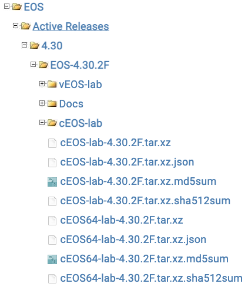

# Building Containerlab with cEOS

## Workshop

<!-- Do not add page number on this slide -->
<!--
_paginate: false
-->

```text
How to build a lab environment
with Containerlab and cEOS-lab

Petr Ankudinov, 2024
```


---

# Agenda

<style scoped>section {font-size: 20px;}</style>


- Setup Docker on the host
- Install Containerlab and import cEOS-lab image
- Deploy the lab
- Inspect and destroy the lab
- Deploy the lab with a custom startup config
- Make a packet capture
- cLab in a Container
- Possible caveats

> This workshop is a step-by-step guide explaining how to build a lab environment with [Containerlab](https://containerlab.srlinux.dev/) and Arista cEOS-lab. It is  focusing on essential and cEOS-lab specific features. Please check [Containerlab documentation](https://containerlab.srlinux.dev/) for more details.

---

# How To Run The Workshop

<style scoped>section {font-size: 24px;}</style>

To run the labs in this workshop, you can use one of the following options:

- Build you own Ubuntu VM from scratch. (Recommended!)
  - This option will allow you to experience the entire cLab enviroment build process from the very start, without any pre-installed dependancies
  - Requirements
    - Ubuntu LTS 22.04 or later
    - 8 GB RAM and 4 vCPUs
- Start the [Github Codespace](https://codespaces.new/{{gh.repository}}?quickstart=1&devcontainer_path=.devcontainer%2Fclab-build-containerlab-with-ceos%2Fdevcontainer.json) from this repository. (Fastest!)
- Open the lab dev container locally on your laptop with Docker Desktop or sever with Docker CE:
  - you can [download required files here](https://arista-netdevops-community.github.io/one-click-se-demos/lab_archives/clab-build-containerlab-with-ceos.tar.gz) and open them in VSCode
  - when running the lab locally, you must set all required environment variables on your machine

---

# CPU Architechture

- Only x86 CPU architecture is supported!
- It is technically possible to [run Container lab on ARM](https://containerlab.dev/install/#containerlab-on-arm-based-macs), but there are no network device images available for ARM as of May 2024.

---

# Setup Docker on the Host

<style scoped>section {font-size: 22px;}</style>

<div class="columns">
<div>

> Check if Docker is already installed. In this case you can skip the steps below.

1. Install Docker on the host. The detailed instructions are available [here](https://docs.docker.com/engine/install/ubuntu/). You can used one-liner script for that.
2. Add your user to the `docker` group.
3. Logout and login again to apply the changes.
4. Check the Docker version and run `hello-world` container to test functionality.
5. You must be able to run `docker` commands without `sudo` if it was installed correctly.

</div>
<div>

```bash
# install Docker
sudo curl -fsSL https://get.docker.com | sh
# add user to the docker group
sudo usermod -aG docker ${USER}
# test docker
docker --version
docker run hello-world
```

> **NOTE**: If you are running this workshop in Codespace or provided dev container, Docker is pre-installed. As the workshop magic happens inside a container in this case, we rely on Docker-in-Docker concept to provide required functionality.

</div>
</div>

---

# Setup Git (Optional)

<style scoped>section {font-size: 26px;}</style>

- Git must be pre-installed on a Linux system. Otherwise you are in a wrong place. Escape! 👾 🚀
- Setup your name and email address:

  ```bash
  git config --global user.name "<first-and-2nd-name>"
  git config --global user.email "<your-email>"
  ```

- Check the current configuration:

  ```bash
  git config --list
  ```

> **NOTE**: On Codespace Git is pre-installed and pre-configured.

---

# Download cEOS-lab Image

<style scoped>section {font-size: 20px;}</style>

1. Login to [Arista Software Download](https://www.arista.com/en/support/software-download) portal. You need to have an account to download the image.
2. Select `EOS > Active Releases > 4.30 > EOS-4.30.6M > cEOS-lab`.
3. Download `cEOS-lab-4.30.6M.tar.xz` image.
4. Upload the image to your lab VM. For example, you can use SFTP to transfer the image:

  ```bash
  sftp ${REMOTE_USER}@${UBUNTU_VM_IP}:/home/${REMOTE_USER}/${IMAGE_DIR} <<< $'put cEOS-lab-4.30.6M.tar*'
  # for example:
  # sftp user@10.10.10.11:/home/user/images <<< $'put cEOS-lab-4.30.6M.tar*'
  ```

> If Github Codespace or provided Dev Container is used and the Arista token is set, the image will be pulled from arista.com automatically.



---

# Import cEOS-lab Image

<style scoped>section {font-size: 22px;}</style>

1. Go to the directory with the uploaded image and import the image:

    ```bash
    docker import cEOS-lab-4.30.6M.tar.xz arista/ceos:4.30.6M
    ```

    > NOTE: you can also import the image with the tag latest to allow quick "upgrade" of those lab where specific version is not required: `docker tag arista/ceos:4.30.2F arista/ceos:latest`

2. Confirm that the image was imported successfully:

    ```console
    $ docker image ls
    REPOSITORY    TAG       IMAGE ID       CREATED          SIZE
    arista/ceos      4.30.6M   21b540a4a343   45 minutes ago   1.95GB
    arista/ceos      latest    21b540a4a343   45 minutes ago   1.95GB
    hello-world   latest    b038788ddb22   3 months ago     9.14kB
    ```

---

# Install Containerlab

<style scoped>section {font-size: 22px;}</style>

- It's just a one-liner:
  
  ```bash
  bash -c "$(curl -sL https://get.containerlab.dev)"
  ```

- Refer to the [Containerlab quick start documentation](https://containerlab.dev/quickstart/) for the details.

---

# Deploy The Lab

<style scoped>section {font-size: 20px;}</style>


- Inspect `topology.clab.yml` and deploy the lab:

  ```bash
  sudo containerlab deploy
  ```

- This command will deploy Containerlab with the default EOS configuration provided by Containerlab.
- (Optional): you can add `--debug` flag to get additional information while Containerlab is starting.

> NOTE: there is no need to specify topology file explicitely, as there only one `.clab.yml` file in the current directory. When multiple topologies are present, the topology to be started must be specified explicitely.

---

# Inspect the Lab

<style scoped>section {font-size: 12px;}</style>

Once the lab is ready, you'll see a table with the list of deployed containers, their host names and management IPs:

```text
+---+------+--------------+---------------------+------+---------+--------------+--------------+
| # | Name | Container ID |        Image        | Kind |  State  | IPv4 Address | IPv6 Address |
+---+------+--------------+---------------------+------+---------+--------------+--------------+
| 1 | h01  | 5367c60bcb1c | arista/ceos:4.30.6M | ceos | running | 10.0.3.1/16  | N/A          |
| 2 | l01  | 783f209af70e | arista/ceos:4.30.6M | ceos | running | 10.0.2.1/16  | N/A          |
| 3 | l02  | 47f9904801ce | arista/ceos:4.30.6M | ceos | running | 10.0.2.2/16  | N/A          |
| 4 | s01  | 82812ceefb42 | arista/ceos:4.30.6M | ceos | running | 10.0.1.1/16  | N/A          |
| 5 | s02  | 2839bc4a1ca7 | arista/ceos:4.30.6M | ceos | running | 10.0.1.2/16  | N/A          |
+---+------+--------------+---------------------+------+---------+--------------+--------------+
```

> You can call the table again any time with `sudo clab inspect -t topology.clab.yml`. Or simply `sudo clab inspect`.

Containerlab creates corresponding entries in the `/etc/hosts` file as well:

```bash
$ cat /etc/hosts | grep clab- -A 5
###### CLAB-build-clab-with-ceos-START ######
10.0.2.1        l01
10.0.2.2        l02
10.0.1.1        s01
10.0.1.2        s02
10.0.3.1        h01
###### CLAB-build-clab-with-ceos-END ######
```

You can also list containers using docker command:

```console
$ docker container ls
CONTAINER ID   IMAGE                 COMMAND                  CREATED          STATUS          PORTS     NAMES
5367c60bcb1c   arista/ceos:4.30.6M   "bash -c '/mnt/flash…"   18 minutes ago   Up 18 minutes             h01
82812ceefb42   arista/ceos:4.30.6M   "bash -c '/mnt/flash…"   18 minutes ago   Up 18 minutes             s01
783f209af70e   arista/ceos:4.30.6M   "bash -c '/mnt/flash…"   18 minutes ago   Up 18 minutes             l01
2839bc4a1ca7   arista/ceos:4.30.6M   "bash -c '/mnt/flash…"   18 minutes ago   Up 18 minutes             s02
47f9904801ce   arista/ceos:4.30.6M   "bash -c '/mnt/flash…"   18 minutes ago   Up 18 minutes             l02
```

---

# Access cEOS-lab CLI

<style scoped>section {font-size: 20px;}</style>

There are few options to access cEOS-lab CLI:

- SSH to the container. For ex.:
  
  ```bash
  # the default login is `admin` and password is `admin`
  ssh admin@l01
  ```

- Connect to the "console" using Docker command. For ex.: `docker exec -it l01 CLi`

  > NOTE: `docker exec -it l01 bash` allows to connect directly to the switch shell.

Execute few command to confirm that cEOS-lab is functioning:

- `show version`
- `show lldp neighbors`
- `show running-config`

---

# Destroy the Lab

<style scoped>section {font-size: 22px;}</style>

- Destroy the lab with `sudo containerlab destroy`  
- This will stop all containers, but will keep the files created by clab for the next run. For example, startup-configs.  
- Check the flash content for leaf1 and inspect it's startup config:

  ```console
  $ ls clab-build-clab-with-ceos/l01/flash
  AsuFastPktTransmit.log  SsuRestoreLegacy.log  debug             kickstart-config  startup-config
  Fossil                  aboot                 fastpkttx.backup  persist           system_mac_address
  SsuRestore.log          boot-config           if-wait.sh        schedule          tpm-data
  ```

- To remove these files and have a clean environment on the next run, use `--cleanup` flag:

  ```bash
  sudo containerlab destroy --cleanup
  ```

---

<style scoped>section {font-size: 45px;}</style>


# Q&A

- [Containerlab](https://containerlab.srlinux.dev/)
- [This repository](https://github.com/{{gh.repository}})
